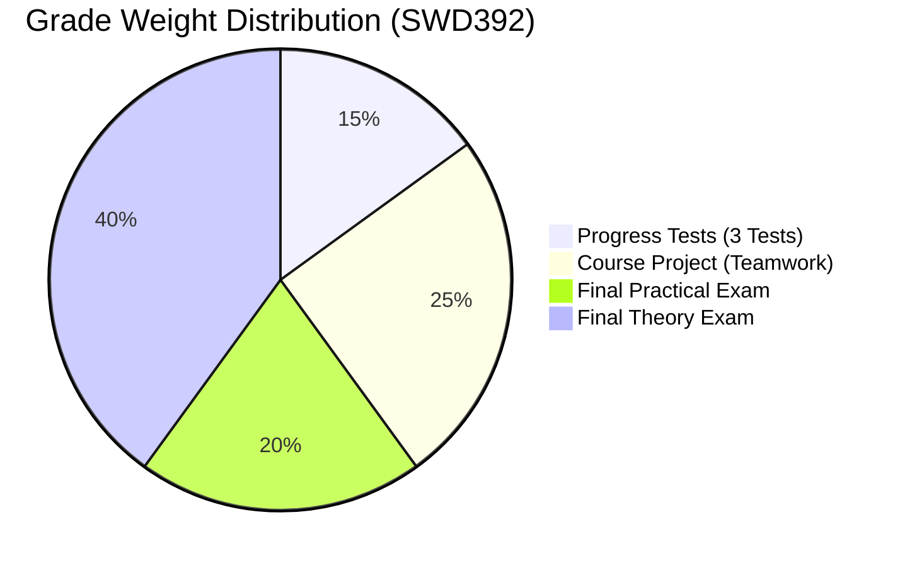
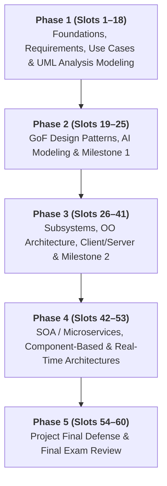

# SWD392 - Software Architecture and Design 🏛️💻

> **Course:** Software Architecture and Design  
> **Course Code:** SWD392 | **Credits:** 3  
> **Term:** FALL26 - FPT University  

---

## 📌 Course Overview

This repository contains learning materials, lecture notes, lab assignments, and project deliverables for **SWD392 (Software Architecture and Design)**.

The course provides comprehensive knowledge and practical methodologies in:
- Analysis, modeling, and architectural design for large-scale, complex software systems.
- Standard **UML 2.x** notation and the **COMET** (*Collaborative Object Modeling and Architectural Design Method*) framework.
- Core architectural styles: **N-Tier Client/Server**, **Service-Oriented Architecture (SOA) / Microservices**, **Component-Based**, and **Concurrent & Real-Time Systems**.
- Classic Object-Oriented Design Patterns (**GoF Design Patterns**).
- Practical integration of modern AI-assisted engineering tools (**ChatGPT, GitHub Copilot, PlantUML, Mermaid**).

> 📄 **Complete Syllabus & Lesson Plan:** [Subject_detail.md](file:///e:/FPT/FALL26/SWD392/Subject_detail.md)

---

## 🎯 Course Learning Outcomes (CLOs)

| CLO | Description |
| :--- | :--- |
| **CLO1** | Master the software design lifecycle, foundational concepts, UML notations, and design methods. |
| **CLO2** | Apply COMET/UML design steps, object associations, and multiplicity relationships effectively. |
| **CLO3** | Construct complete software analysis models: Class/Object diagrams, Statecharts for state-dependent behavior, and Interaction Diagrams per Use Case using AI tools for diagram generation. |
| **CLO4** | Synthesize overall software design models (subsystem structuring, OO design, component-based architectures) and evaluate design decisions. |
| **CLO5** | Design relational database schemas aligned with software architecture and design models. |
| **CLO6** | Analyze, articulate, and implement classic Gang of Four (GoF) Design Patterns. |
| **CLO7** | Effectively leverage AI assistants (ChatGPT, Copilot, PlantUML) for architectural suggestions, prompt engineering, and automated UML generation. |

---

## 📊 Grading & Assessment Scheme



| Assessment Component | Weight | Type | Criteria & Format | Scope / Deliverables |
| :--- | :---: | :---: | :--- | :--- |
| **Progress Tests** | **15%** | On-going | 3 Multiple-Choice Tests (5% each, 30 mins) | Theory coverage across key milestones (Slots 22, 38, 54). |
| **Course Project** | **25%** | On-going | Team project (4–5 students/team)<br>*(Every milestone requires $\ge 5.0/10$)* | **1. On-going Assessment (40% of Project):**<br>• *Evaluation 1 (20%):* Requirements analysis, Use Cases & UML diagrams with AI prompt report.<br>• *Evaluation 2 (20%):* Subsystem design, OO architecture, DB schema.<br><br>**2. Final Presentation & Demo (60% of Project):**<br>• Integrated product demo (API, Web, Mobile): 30%<br>• Individual mastery of assigned module: 20%<br>• Soft skills & collaboration: 10%<br>• Critical evaluation of AI utilization and prompt ethics. |
| **Final Exam - Practical** | **20%** | Final Exam | Architecture / Modeling Assignment (85 mins) | System architecture design & UML modeling ($\ge 4.0/10$ required). |
| **Final Exam - Theory** | **40%** | Final Exam | Computer-based MCQ (60 questions / 60 mins) | Comprehensive syllabus coverage ($\ge 4.0/10$ required). |

> ⚠️ **Passing Conditions:**
> - Minimum **80%** class attendance.
> - Cumulative Course Average $\ge 5.0 / 10$.
> - All Course Project milestones $\ge 5.0 / 10$.
> - Both Final Exam components (Practical and Theory) must meet the passing threshold: $\ge 4.0 / 10$ each.

---

## 🗺️ Course Roadmap (60 Slots)



---

## 🗓️ Key Milestones & Checklist

- [ ] **Slots 1–6:** Form teams (4–5 students) and finalize project topic/scope.
- [ ] **Slots 7–18:** Master requirements modeling, Static analysis (Class diagrams), Dynamic analysis (Sequence & Statecharts).
- [ ] **Slot 22:** 📝 **Progress Test 1** (30 mins) & 🎯 **Course Project - Evaluation 1** (SRS & UML Analysis Models).
- [ ] **Slot 38:** 📝 **Progress Test 2** (30 mins) & 🎯 **Course Project - Evaluation 2** (Architecture, Subsystems & DB Schema).
- [ ] **Slot 54:** 📝 **Progress Test 3** (30 mins) & Architecture documentation review.
- [ ] **Slots 55–59:** 🚀 **Final Project Defense** (Final presentation, team Q&A, and live integrated demo).
- [ ] **Final Exams:**
  - [ ] Practical Exam (85 mins, $\ge 4.0/10$)
  - [ ] Theory Exam (60 questions / 60 mins, $\ge 4.0/10$)

---

## 🛠️ Recommended Tech Stack & Tools

- **CASE & Diagramming:** PlantUML, Mermaid.js, Visual Paradigm, Draw.io, StarUML.
- **AI Assistive Tools:** ChatGPT, GitHub Copilot, Claude.
- **Primary Textbooks & References:**
  - *Software Modeling and Design: UML, Use Cases, Patterns, and Software Architectures* – Hassan Gomaa, Cambridge University Press, 2011.
  - *Design Patterns: Elements of Reusable Object-Oriented Software* – Erich Gamma, Richard Helm, Ralph Johnson, John Vlissides (GoF).
  - *UML Distilled: A Brief Guide to the Standard Object Modeling Language (3rd Edition)* – Martin Fowler.

---

## 📁 Repository Structure

```text
SWD392/
├── Subject_detail.md       # Official course syllabus and schedule
├── README.md               # Course repository overview and guide (this file)
├── docs/                   # Lecture notes, cheatsheets, and reference materials
│   ├── design-patterns/    # GoF pattern summaries and examples
│   └── diagrams/           # PlantUML / Mermaid architectural diagrams
├── assignments/            # Homework and Progress Test preparation
└── project/                # Course project workspace
    ├── srs/                # Software Requirements Specification
    ├── architecture/       # Subsystem, component, and database designs
    └── src/                # Source code and integration demo
```
