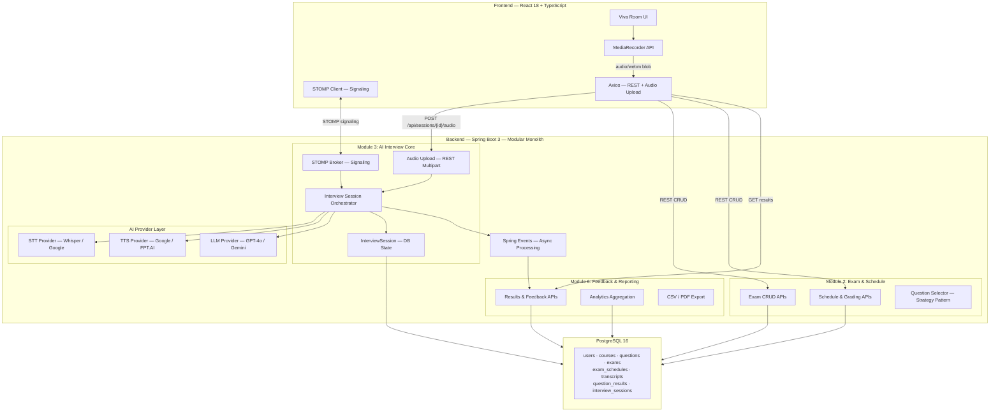
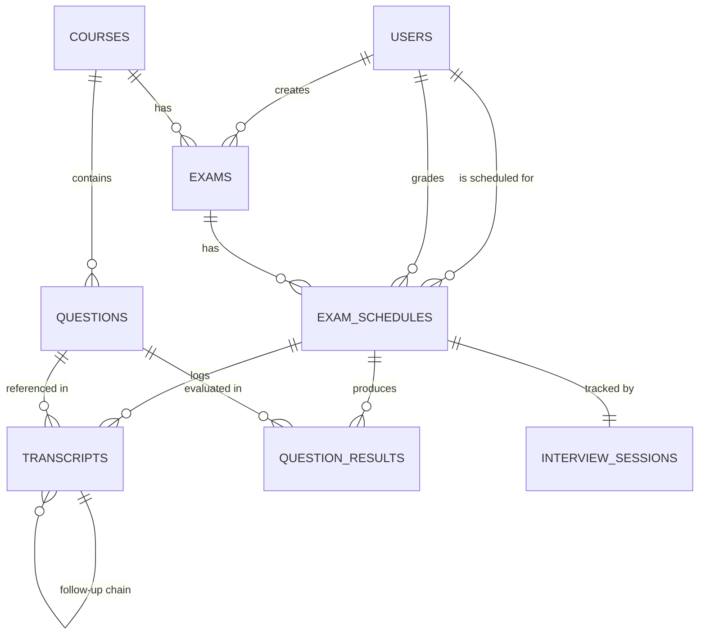
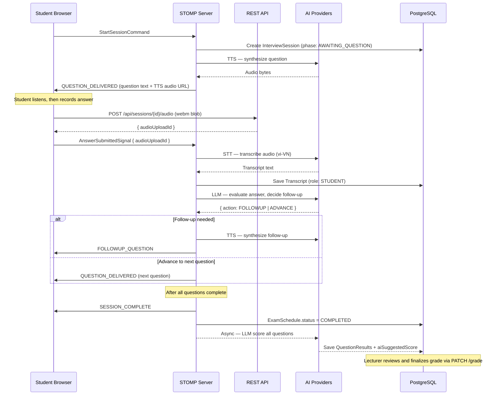

# 🎓 AIVES — AI-powered Viva Exam System

> **Course Project for SWD392** — Software Architecture and Design  
> **Term:** FALL 2026 · FPT University  
> **Architecture:** Modular Monolith · **Stack:** Spring Boot 3 · React 18 · PostgreSQL 16

---

## 📌 About

**AIVES** automates university oral (viva) examinations using AI. The system delivers questions via Text-to-Speech, captures student spoken responses, generates adaptive follow-up probing through LLM, and produces structured performance analytics — all while keeping the lecturer as the final authority on grading.

### Key Capabilities

- 🎤 **AI Virtual Examiner** — Delivers oral questions via TTS and conducts adaptive follow-up probing when answers are vague or incomplete.
- 🧠 **Vietnamese Speech Processing** — STT transcription optimized for Vietnamese academic terminology.
- 📊 **Automated Scoring & Analytics** — AI-generated suggested scores with per-question feedback, class-wide analytics dashboards, and exportable grade reports.
- 👨‍🏫 **Human-in-the-Loop Governance** — AI scores are advisory only; lecturers review transcripts and finalize all official grades.
- 🔄 **Session Resilience** — Interview progress is DB-persisted; supports browser refresh and network reconnection without losing progress.

---

## 🏗️ System Architecture



---

## 🧩 Functional Modules

| Module | Scope | Key Features |
|--------|-------|-------------|
| **Module 2** — Exam & Schedule | Exam lifecycle & student timeslots | Exam CRUD, roster import, timeslot generation, question constraints, randomized question selection |
| **Module 3** — AI Interview Core | Real-time viva examination | WebSocket signaling, TTS question delivery, audio capture & upload, STT transcription, LLM adaptive follow-ups, DB-backed session state |
| **Module 6** — Feedback & Reporting | Post-exam analytics | Per-question AI scoring & feedback, lecturer grading queue, score distribution charts, difficulty rankings, CSV/PDF export |

---

## 🗄️ Database Schema



> 📄 **Full schema details:** [Database.md](docs/Database.md) · **ERD source:** [DrdDiagram.md](docs/DrdDiagram.md)

---

## ⚡ Interview Flow



---

## 🛠️ Tech Stack

| Layer | Technology | Purpose |
|-------|-----------|---------|
| **Backend** | Java 17+ · Spring Boot 3 | REST APIs, WebSocket (STOMP), async event processing, security |
| **Frontend** | React 18 · TypeScript · Vite | SPA with audio recording (MediaRecorder API), real-time signaling |
| **Database** | PostgreSQL 16 · Flyway | Transactional storage, schema migrations |
| **Real-time** | STOMP over SockJS | Interview event signaling (no audio payload) |
| **Audio Upload** | REST Multipart | `audio/webm;codecs=opus` blob upload |
| **AI — STT** | OpenAI Whisper (default) / Google Cloud Speech | Vietnamese speech-to-text transcription |
| **AI — TTS** | Google Cloud TTS / FPT.AI | Vietnamese text-to-speech question delivery |
| **AI — LLM** | OpenAI GPT-4o / Google Gemini | Adaptive follow-up generation, structured scoring |
| **Auth** | Spring Security + JWT | Role-based access (ADMIN, LECTURER, STUDENT) |
| **State Mgmt** | Zustand | Frontend interview state machine |
| **Charts** | Recharts | Analytics dashboards |

---

## 📁 Repository Structure

```text
SWD392/
├── README.md                          # Project overview (this file)
├── back-end/                          # Spring Boot application
│   ├── src/main/java/
│   │   ├── config/                    # Security, WebSocket, async, AI provider configs
│   │   ├── module/
│   │   │   ├── exam/                  # Module 2 — Exam & Schedule Management
│   │   │   │   ├── entity/
│   │   │   │   ├── repository/
│   │   │   │   ├── service/
│   │   │   │   ├── controller/
│   │   │   │   └── dto/
│   │   │   ├── interview/             # Module 3 — AI Interview Core
│   │   │   │   ├── entity/
│   │   │   │   ├── repository/
│   │   │   │   ├── service/
│   │   │   │   ├── websocket/
│   │   │   │   └── dto/
│   │   │   └── reporting/             # Module 6 — Feedback & Reporting
│   │   │       ├── entity/
│   │   │       ├── repository/
│   │   │       ├── service/
│   │   │       ├── controller/
│   │   │       └── dto/
│   │   ├── ai/                        # AI provider abstraction layer
│   │   │   ├── stt/
│   │   │   ├── tts/
│   │   │   └── llm/
│   │   └── shared/                    # Base entities, exceptions, utils
│   └── src/main/resources/
│       ├── application.yml
│       ├── db/migration/              # Flyway V1–V8 scripts
│       └── prompts/                   # LLM system prompt templates
├── front-end/                         # React + TypeScript application
│   ├── src/
│   │   ├── components/                # Reusable UI components
│   │   ├── pages/                     # Route-level page components
│   │   │   ├── ExamList/
│   │   │   ├── ExamCreate/
│   │   │   ├── VivaRoom/
│   │   │   ├── GradingQueue/
│   │   │   ├── StudentResults/
│   │   │   └── Analytics/
│   │   ├── hooks/                     # Custom hooks
│   │   │   ├── useAudioRecorder.ts
│   │   │   ├── useAudioPlayback.ts
│   │   │   ├── useAudioUploader.ts
│   │   │   └── useInterviewWebSocket.ts
│   │   ├── services/                  # API client functions
│   │   ├── store/                     # Zustand state stores
│   │   └── types/                     # TypeScript type definitions
│   └── vite.config.ts
└── docs/                              # Project documentation
    ├── Project_requirement.md         # Functional requirements
    ├── Database.md                    # Schema specification
    ├── DrdDiagram.md                  # ERD (Mermaid source)
    ├── Subject_detail.md              # Course syllabus
    └── implementation_tasks.md        # Implementation task checklist (v2)
```

---

## 🚀 Getting Started

### Prerequisites

| Tool | Version |
|------|---------|
| Java JDK | 17+ |
| Node.js | 18+ |
| PostgreSQL | 16+ |
| Maven or Gradle | Latest |

### Backend Setup

```bash
# Navigate to backend
cd back-end

# Configure database connection
# Edit src/main/resources/application.yml with your PostgreSQL credentials

# Run with Maven
./mvnw spring-boot:run

# Or with Gradle
./gradlew bootRun
```

The server starts at `http://localhost:8080`. Flyway will auto-run all migrations on startup.

### Frontend Setup

```bash
# Navigate to frontend
cd front-end

# Install dependencies
npm install

# Start dev server
npm run dev
```

The app starts at `http://localhost:5173` with hot module replacement enabled.

### Environment Variables

Create `back-end/src/main/resources/application-dev.yml`:

```yaml
spring:
  datasource:
    url: jdbc:postgresql://localhost:5432/aives_db
    username: your_username
    password: your_password

aives:
  ai:
    openai-api-key: ${OPENAI_API_KEY}
    google-cloud-credentials: ${GOOGLE_APPLICATION_CREDENTIALS}
  audio:
    mode: BUFFERED  # BUFFERED (default) or STREAMING
    storage-path: ./uploads/audio
```

---

## 🔑 Key Design Decisions

| Decision | Rationale |
|----------|-----------|
| **Modular Monolith** | Single deployable unit with clear module boundaries — simpler ops for a university project while maintaining separation of concerns. |
| **STOMP for signaling only** | WebSocket handles lightweight interview events; audio data goes via REST multipart to avoid Base64 overhead (~33% inflation). |
| **DB-backed session state** | Interview progress survives browser refresh and network drops. `ConcurrentHashMap` serves as hot cache with DB write-through. |
| **AI scores are advisory** | Lecturer retains final grading authority. `aiSuggestedScore` ≠ `finalScore` — explicit approval required via dedicated endpoint. |
| **Strategy pattern for questions** | Pluggable question selection (random now, adaptive later) without modifying the interview orchestrator. |
| **Provider abstraction for AI** | Swap STT/TTS/LLM vendors without touching business logic — critical for Vietnamese-language accuracy tuning. |
| **Whisper as default STT** | Accepts `webm/opus` natively — zero transcoding for the PoC. Google STT (requires `LINEAR16`) available as fallback. |

---

## 📚 Documentation

| Document | Description |
|----------|-------------|
| [Project_requirement.md](docs/Project_requirement.md) | Functional requirements for Modules 2, 3, 6 |
| [Database.md](docs/Database.md) | PostgreSQL schema specification |
| [DrdDiagram.md](docs/DrdDiagram.md) | Entity Relationship Diagram (Mermaid) |
| [implementation_tasks.md](docs/implementation_tasks.md) | Detailed implementation task checklist (v2) |
| [Subject_detail.md](docs/Subject_detail.md) | SWD392 course syllabus |

---

## 👥 Team

| Role | Responsibility |
|------|---------------|
| **Backend Engineers** | Spring Boot APIs, WebSocket, AI provider integration, Flyway migrations |
| **Frontend Engineers** | React UI, audio hooks, interview state machine, analytics dashboards |
| **AI/ML Engineer** | STT/TTS/LLM prompt engineering, Vietnamese language optimization |

> **Course:** SWD392 — Software Architecture and Design  
> **University:** FPT University · FALL 2026
