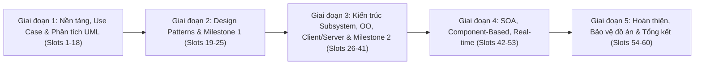

# Đề cương chi tiết: SWD392 - Software Architecture and Design
> **Tên học phần:** Kiến trúc và Thiết kế Phần mềm  
> **Mã học phần:** SWD392  
> **Quyết định ban hành:** 377/QĐ-ĐHFPT ngày 04/09/2026  

---

## 1. Thông tin chung (Course Information)

| Thuộc tính | Chi tiết |
| :--- | :--- |
| **Trình độ đào tạo** | Đại học (Bachelor) |
| **Số tín chỉ** | 3 tín chỉ |
| **Thời lượng học tập** | 150 giờ học tổng cộng:  - 45 giờ tiếp xúc giảng viên (60 slots trên lớp) - 102.6 giờ tự học - 145 phút thi cuối kỳ (Final Exam) |
| **Điều kiện tiên quyết** | SWE201c hoặc SWE202c, PRO192 |
| **Thang điểm** | Thang điểm 10 (Điểm trung bình tối thiểu để qua môn: 5.0) |
| **Phương pháp giảng dạy**| Kiến tạo xã hội (Social Constructivism), Thuyết giảng trên lớp (In-class lecture), Dạy học dựa trên truy vấn (Inquiry-based Teaching) |

### Mô tả học phần (Course Description)
Môn học cung cấp các khái niệm, quy trình và phương pháp thiết kế kiến trúc phần mềm cho các hệ thống quy mô lớn, phức tạp:
- **Ký hiệu & Phương pháp:** Ký hiệu chuẩn UML, phương pháp COMET (Collaborative Object Modeling and Architectural Design Method).
- **Phân tích & Thiết kế:** Phân tích mô hình hóa yêu cầu, thiết kế kiến trúc hệ thống con (Subsystems), hướng đối tượng (OO Design).
- **Các phong cách kiến trúc (Architectural Styles):** Client/Server, Hướng dịch vụ (SOA - Service-Oriented Architecture), Dựa trên thành phần (Component-Based), Hệ thống đồng thời & thời gian thực (Concurrent / Real-time).
- **Thực hành & Dự án:** Sinh viên làm việc theo nhóm để hoàn thành đồ án thiết kế hệ thống tương đối phức tạp và thực hành tích hợp các công cụ AI hỗ trợ (ChatGPT, PlantUML, GitHub Copilot).

---

## 2. Chuẩn đầu ra học phần (Course Learning Outcomes - CLOs)

- **CLO1:** Nắm vững nền tảng thiết kế phần mềm bao gồm quy trình thiết kế, các khái niệm cơ bản, ký hiệu và phương pháp.
- **CLO2:** Giải thích và áp dụng được các bước trong phương pháp COMET/UML, khái niệm thiết kế và quan hệ kết hợp (multiplicity of associations).
- **CLO3:** Sử dụng thành thạo các artifacts trong việc xây dựng mô hình phân tích phần mềm (Software Analysis Model): Class & Object, Statechart cho đối tượng phụ thuộc trạng thái, Object Interaction Diagram cho từng Use Case; ứng dụng công cụ AI sinh biểu đồ UML.
- **CLO4:** Thiết kế kiến trúc tổng thể phần mềm (Software Design Model); phân tích, đánh giá giải pháp thiết kế kết hợp khuyến nghị cải tiến từ AI.
- **CLO5:** Thiết kế cơ sở dữ liệu quan hệ (Relational Database) phù hợp với mô hình thiết kế phần mềm.
- **CLO6:** Giải thích cấu trúc và ghi chép tài liệu cho các mẫu thiết kế (Design Patterns).
- **CLO7:** Sử dụng hiệu quả các công cụ AI (ChatGPT, PlantUML, GitHub Copilot) hỗ trợ phân tích và thiết kế kiến trúc: gợi ý mô hình kiến trúc phù hợp từ yêu cầu hệ thống và tự động tạo biểu đồ UML (Use Case, Class, Sequence, Statechart...).

---

## 3. Tài liệu học tập & Công cụ (Materials & Toolsets)

### Giáo trình chính (Main Textbook)
- **Software Modeling and Design: UML, Use Cases, Patterns, and Software Architectures** – Hassan Gomaa, Cambridge University Press, 2011.

### Tài liệu tham khảo (Reference Books)
1. **UML Distilled: A Brief Guide to the Standard Object Modeling Language** (3rd Edition) – Martin Fowler, Addison-Wesley, 2004.
2. **Design Patterns: Elements of Reusable Object-Oriented Software** – Erich Gamma, Richard Helm, Ralph Johnson, John Vlissides (GoF), Addison-Wesley, 1995.

### Công cụ & Phần mềm hỗ trợ (Tools & Software)
- **CASE & Modeling:** The Rational Software Architect CASE tool, Visual Paradigm, MagicDraw, Microsoft Visio, PlantUML, Mermaid.
- **AI & Code Tools:** ChatGPT, GitHub Copilot.

---

## 4. Quy chế đánh giá & Tiêu chuẩn tính điểm (Assessment Scheme)

> [!IMPORTANT]
> **Điều kiện dự thi & qua môn:**
> - **Điểm danh (Attendance):** Tham dự tối thiểu **80%** tổng số buổi học trên lớp.
> - **Điểm trung bình tích lũy (Average Mark):** $\ge 5.0 / 10$.
> - **Course Project:** Tất cả các đợt On-going Evaluation phải đạt $\ge 5.0 / 10$.
> - **Final Exam:** Mỗi phần (Thực hành & Lý thuyết) bắt buộc phải đạt điểm liệt $\ge 4.0 / 10$.

### Bảng phân bổ trọng số điểm

| Thành phần đánh giá | Trọng số | Loại hình | Tiêu chí / Hình thức | Nội dung / Sản phẩm nộp |
| :--- | :---: | :---: | :--- | :--- |
| **Progress Tests** | **15%** | On-going | 3 bài trắc nghiệm (5% mỗi bài), thời lượng 30 phút/bài | Kiểm tra kiến thức lý thuyết các chương đã học (vào các Slots 22, 38, 54). |
| **Course Project** | **25%** | On-going | Làm việc nhóm (4–5 SV/nhóm); yêu cầu điểm mỗi đợt $\ge 5.0$ | **1. On-going Assessment (40% điểm đồ án):** • *Evaluation 1 (20%):* Phân tích yêu cầu & mô hình hóa (Use case description, Static/Dynamic UML diagrams). Báo cáo prompt AI và giải trình độc lập. • *Evaluation 2 (20%):* Thiết kế kiến trúc tổng thể, chia subsystem, OO design, Database schema.  **2. Final Presentation (60% điểm đồ án):** • Demo sản phẩm tích hợp (Web API, Web Admin, Mobile App...): 30% • Mức độ làm chủ phần công việc được giao: 20% • Kỹ năng mềm & thái độ làm việc: 10% • Đánh giá ứng dụng AI: Mức độ thấu hiểu output, tùy biến mã nguồn, tính minh bạch và đạo đức. |
| **Final Exam - Practical** | **20%** | Final Exam | Tự luận / Assignment, thời gian làm bài: 85 phút | Thiết kế kiến trúc / mô hình hóa theo đề thi do Hội đồng khảo thí chấm (yêu cầu $\ge 4.0/10$). |
| **Final Exam - Theory** | **40%** | Final Exam | Trắc nghiệm trên máy tính, 60 câu / 60 phút | Đánh giá toàn bộ kiến thức trong syllabus môn học (yêu cầu $\ge 4.0/10$). |

---

## 5. Kế hoạch giảng dạy chi tiết (Course Syllabus - 60 Slots)

### Chi tiết từng chặng học tập:

| Slots | Chủ đề / Nội dung chính | Tài liệu đọc (Chapters) | Ứng dụng AI & Điểm mốc đánh giá |
| :---: | :--- | :--- | :--- |
| **1 – 6** | • Giới thiệu môn học & đồ án môn học (Course Project) • Nền tảng thiết kế phần mềm: Quy trình, Khái niệm, Ký hiệu và Phương pháp | Textbook Ch. 1–4 | Phân chia nhóm đồ án, xác định đề tài |
| **7 – 10** | • Mô hình hóa yêu cầu & Use Case (Requirements & Use Case Modeling) • Thuộc tính chất lượng phần mềm (Software Quality Attributes) | Textbook Ch. 5–6, Ch. 20 | Ứng dụng **ChatGPT** sinh mô tả Use Case từ yêu cầu; dùng **GitHub Copilot** sinh boilerplate code |
| **11 – 14**| • Phân tích mô hình hóa tĩnh (Analysis Modeling – Static Modeling) • Cấu trúc hóa Đối tượng & Lớp (Object and Class Structuring) | Textbook Ch. 7, Ch. 8 | Thiết kế Class Diagram, mô hình hóa quan hệ thực thể |
| **15 – 18**| • Phân tích mô hình hóa động (Dynamic Interaction Modeling) • Máy trạng thái hữu hạn & Biểu đồ trạng thái (FSM & Statecharts) | Textbook Ch. 9, Ch. 10, Ch. 11 | Thực hành dùng AI tạo sinh biểu đồ **PlantUML / Mermaid** |
| **19 – 21**| • Các mẫu thiết kế GoF (Design Patterns):   - Creational Patterns (Factory, Singleton, Builder...)   - Structural Patterns (Adapter, Composite, Facade...)   - Behavioral Patterns (Observer, Strategy, State...) | GoF & Reference | Phân tích bài toán áp dụng pattern thực tế |
| **22 – 25**| • Vận dụng ChatGPT đề xuất Design Patterns phù hợp • **Kiểm tra tiến độ 1** • **Đánh giá đồ án đợt 1** | | 📝 **Progress Test 1 (Slot 22)** 🎯 **Course Project - Evaluation 1:** Báo cáo yêu cầu & mô hình hóa UML |
| **26 – 29**| • Tổng quan về Kiến trúc Phần mềm (Overview of Software Architecture) • Thiết kế kiến trúc Hệ thống con (Software Subsystem Architectural Design) | Textbook Ch. 12, Ch. 13 | Phân rã kiến trúc hệ thống lớn thành các subsystems |
| **30 – 33**| • Thiết kế kiến trúc phần mềm Hướng đối tượng (Designing Object-Oriented Software Architectures) | Textbook Ch. 14 | Chi tiết hóa thiết kế lớp và giao diện nghiệp vụ |
| **34 – 37**| • Thiết kế kiến trúc Client/Server (Designing Client/Server Software Architectures) • Nghiên cứu tình huống (Case Study) | Textbook Ch. 15, Ch. 21 | Kiến trúc phân tầng (N-tier), xử lý giao tiếp client-server |
| **38 – 41**| • Ứng dụng ChatGPT/PlantUML đề xuất áp dụng Pattern kiến trúc • **Kiểm tra tiến độ 2** • **Đánh giá đồ án đợt 2** | | 📝 **Progress Test 2 (Slot 38)** 🎯 **Course Project - Evaluation 2:** Đánh giá thiết kế kiến trúc hệ thống & Database |
| **42 – 45**| • Thiết kế kiến trúc Hướng dịch vụ (SOA - Service-Oriented Architectures) • Nghiên cứu tình huống SOA (SOA Case Study) | Textbook Ch. 16, Ch. 22 | Tích hợp Web Services, Microservices, API Design |
| **46 – 49**| • Thiết kế kiến trúc Dựa trên thành phần (Component-Based Software Architectures) • Nghiên cứu tình huống (Case Study) | Textbook Ch. 17, Ch. 23 | Xây dựng và tái sử dụng components, loose coupling |
| **50 – 53**| • Thiết kế kiến trúc hệ thống Đồng thời & Thời gian thực (Concurrent and Real-Time Software Architectures) • Nghiên cứu tình huống (Case Study) | Textbook Ch. 18, Ch. 24 | Xử lý đa luồng (multi-threading), đồng bộ hóa và phản hồi thời gian thực |
| **54** | • **Kiểm tra tiến độ 3** • Hỗ trợ hoàn thiện tài liệu kiến trúc, sinh biểu đồ PlantUML/Mermaid | | 📝 **Progress Test 3 (Slot 54)** |
| **55 – 59**| • **Bảo vệ đồ án cuối khóa (Course Project - Final Evaluation)** | | 🚀 **Final Presentation & Demo:** Bảo vệ đồ án và demo sản phẩm tích hợp theo từng nhóm |
| **60** | • **Tổng kết môn học (Course Review)** | Toàn bộ chương trình | Hệ thống hóa kiến thức trọng tâm chuẩn bị cho kỳ thi Final Exam (Lý thuyết & Thực hành) |

---

## 6. Mốc quan trọng cần ghi nhớ (Key Milestones & Checklist)

- [ ] **Slot 1–6:** Lập nhóm (4–5 SV), chốt đề tài Course Project.
- [ ] **Slot 7–18:** Nắm chắc Use Case, Static Model (Class), Dynamic Model (Sequence, Communication, Statechart).
- [ ] **Slot 22:** 📝 **Progress Test 1** (Trắc nghiệm 30p) & 🎯 **Đánh giá Project đợt 1** (Requirements & UML).
- [ ] **Slot 38:** 📝 **Progress Test 2** (Trắc nghiệm 30p) & 🎯 **Đánh giá Project đợt 2** (Architecture & DB).
- [ ] **Slot 54:** 📝 **Progress Test 3** (Trắc nghiệm 30p) & Rà soát tài liệu hệ thống.
- [ ] **Slot 55–59:** 🚀 **Final Project Defense** (Bảo vệ đồ án, Demo sản phẩm Web/App/API).
- [ ] **Kỳ thi Final Exam:**
  - [ ] **Final Practical (20%):** Tự luận thiết kế kiến trúc/UML (85 phút, điểm liệt $\ge 4.0$).
  - [ ] **Final Theory (40%):** Trắc nghiệm 60 câu (60 phút, điểm liệt $\ge 4.0$).