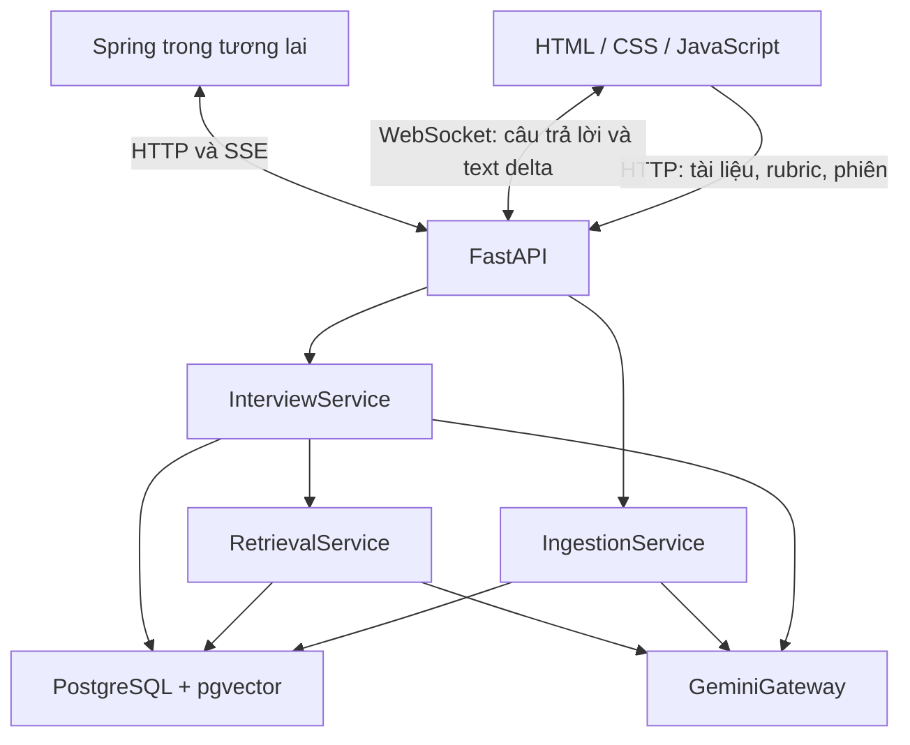
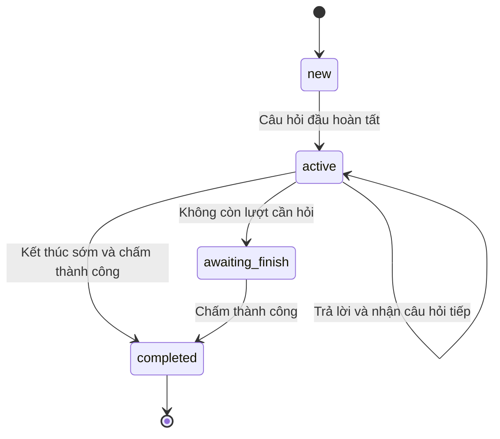

# Kiến trúc Viva

## Thành phần

Đây là một Python service, không phải hệ thống multi-agent. Vai trò giám khảo nằm trong prompt và logic điều phối của backend. Embedding và chat đều gọi Google; pgvector không sinh câu trả lời.

## Import tài liệu

1. Chọn môn, upload tối đa 10 MB.
2. Kiểm tra môn, hash file và tìm tài liệu trùng.
3. Parse nội dung trong thread pool để không chặn event loop. PDF giữ số trang; DOCX lấy đoạn và bảng, không có số trang tin cậy.
4. LangChain `RecursiveCharacterTextSplitter` chia tối đa 1.400 ký tự, chồng lấn 200 ký tự. Đây là **ký tự**, không phải token.
5. Gọi `gemini-embedding-001` với `RETRIEVAL_DOCUMENT`, batch 8 đoạn, output 768 chiều.
6. Chuẩn hóa vector L2, kiểm tra độ dài và số hữu hạn.
7. Ghi Document và toàn bộ Chunk trong một transaction. Chỉ publish tài liệu khi index đầy đủ.

Giới hạn thêm: 200 trang PDF, 200.000 ký tự, 250 chunks/file và 20 tài liệu/môn. Với nhiều file/worker, quota per-course hiện chưa dùng khóa để chống đua tại giới hạn 20; không coi đây là hạn mức sản xuất.

## Rubric

JSON được validate trực tiếp. PDF/DOCX/TXT/MD được Gemini chuyển thành JSON để người dùng xem lại. Rubric không chỉ nằm trong vector DB: toàn bộ tiêu chí và trọng số nằm trong JSONB. Khi tạo phiên, sao chép rubric vào `rubric_snapshot` để các lần sửa/tạo rubric mới không đổi chuẩn chấm giữa buổi.

Mỗi tiêu chí có id, tên, weight và description. Description có thể chứa các mức đạt 0–2, 3–5, 6–8, 9–10. API hiện tạo phiên bản rubric mới khi lưu; chưa có sửa hoặc xóa tại chỗ.

## Một lượt phỏng vấn

1. Client tạo UUID `request_id`, lưu outbox và gửi `start` hoặc `answer`.
2. Backend lấy PostgreSQL advisory transaction lock theo session, chặn hai thao tác đồng thời.
3. Nếu operation cùng ID đã hoàn tất: trả kết quả đã lưu. Nếu ID cũ nhưng nội dung khác: từ chối.
4. Nếu là answer mới: lưu Message user và Operation pending trước khi gọi model.
5. `next_plan` xác định tiêu chí và có hỏi sâu tiếp hay chuyển tiêu chí. Luật xác định ở backend, không để LLM tự điều khiển counters.
6. Embed truy vấn bằng `RETRIEVAL_QUERY`; query chứa tên/mô tả tiêu chí và nội dung gần nhất. Giới hạn truy vấn embedding 1.800 ký tự. Full answer vẫn nằm trong transcript gửi LLM.
7. SQL lọc đúng course, các document IDs chụp ở đầu phiên và embedding model, sau đó xếp hạng cosine, lấy top-k.
8. Gửi một payload JSON chứa transcript đầy đủ, rubric, plan và nguồn tài liệu, cùng system instruction riêng cho Gemini.
9. Chuyển từng text delta về client; không chờ câu hỏi hoàn chỉnh và không tạo hiệu ứng gõ giả.
10. Chỉ khi nhận kết thúc STOP, nội dung không rỗng và không vượt giới hạn mới lưu câu hỏi, tăng counters và complete Operation.
11. Thoát transaction lock trước sự kiện terminal. HTTP SSE và WebSocket dùng chung service và hợp đồng sự kiện.

Nếu lỗi/cancel/disconnect giữa chừng: giữ câu trả lời user và Operation pending, không lưu câu hỏi partial. Retry đúng ID tạo lại câu hỏi từ context đã lưu. Đây là **retry whole turn**, không phải resume từ offset token cũ. Gemini có thể tạo câu hỏi khác ở lần retry.

## Trạng thái phiên

Operation pending tồn tại độc lập với trạng thái phiên. Không lưu cờ busy vĩnh viễn; advisory lock tự giải phóng khi kết thúc transaction hoặc mất kết nối DB. Mỗi thao tác giữ một DB connection cho khóa và dùng các session khác cho đọc/ghi; phù hợp local, cần thiết kế pool/capacity khi mở rộng.

## Chấm điểm

Gửi rubric snapshot, transcript và tập nguồn đã dùng trong các câu hỏi. Gemini trả JSON theo schema `GradeDraft`. Backend kiểm tra:

- Có đúng và đủ criterion IDs, không trùng.
- Score hữu hạn từ 0 đến 10.
- Evidence chỉ trỏ tới Message user và quote là substring thật, cho phép khác whitespace.
- Điểm lớn hơn 0 phải có evidence. Không có dữ liệu thì score 0 và hiển thị chưa đủ dữ liệu.
- Tổng điểm = `sum(score_i * weight_i / 100)`, làm tròn 2 chữ số; không lấy tổng điểm model tự tính.

Nếu JSON/bằng chứng sai, thử tạo lại báo cáo tối đa một lần. Nếu vẫn sai, không lưu báo cáo như kết quả hoàn chỉnh. Model vẫn có thể đánh giá sai về mặt học thuật; lớp kiểm tra này chỉ xác thực cấu trúc và nguồn bằng chứng.

## Database

| Bảng | Vai trò |
|---|---|
| courses | Không gian môn học |
| documents | Tên file, hash, model embedding và số chunks |
| chunks | Text, vị trí/số trang và `vector(768)` |
| rubrics | Rubric gốc dạng JSONB |
| interviews | Snapshot, cấu hình, tiến độ và report |
| messages | Transcript có thứ tự, nguồn cho câu hỏi |
| operations | Request ID, nội dung đầu vào, trạng thái và kết quả để chống trùng |

Không lưu original file bytes: chỉ lưu text đã trích và metadata/hash. pgvector dùng exact search nên bản demo không cần index approximate. Khi dữ liệu lớn, đo latency rồi thêm HNSW và kiểm tra recall khi có metadata filter.

## Đổi model

Model text được lưu khi tạo phiên; đổi `.env` áp dụng cho phiên mới. Nếu provider ngừng hỗ trợ model cũ, cần migration phiên có chủ đích hoặc tạo phiên mới.

Embedding model/chiều vector không được đổi tùy ý. Bản này hỗ trợ chính thức `gemini-embedding-001`, 768 chiều. Chuyển model cần re-embed toàn bộ corpus vào bảng/phiên bản mới, chỉnh gateway theo API tương ứng và chỉ chuyển retrieval khi index đã xong. Các không gian embedding khác nhau không được so sánh trực tiếp.
