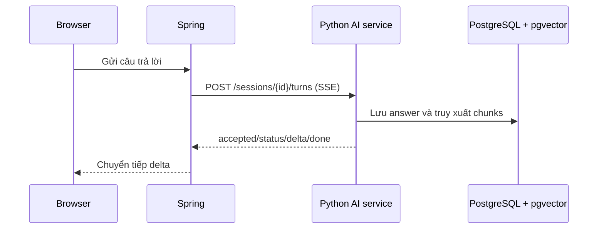

# Tích hợp với Spring sau này

## Khuyến nghị

Giữ Python service ở giai đoạn thử nghiệm AI, rồi để Spring Boot gọi nó qua HTTP/SSE. Đây là lựa chọn phù hợp vì bạn đang cần thử nhanh prompt giám khảo, RAG, chunking và cách chấm điểm. Spring chỉ giữ nghiệp vụ thương mại, user, course, permission và màn hình chính; AI service giữ Gemini SDK, pgvector retrieval và interview orchestration.

Spring AI vẫn là hướng hợp lệ cho giai đoạn production. Spring AI hiện có Google GenAI chat, streaming `Flux<ChatResponse>` và PgVectorStore. Khi logic ổn định, bạn có thể chuyển các service Python sang Java hoặc giữ Python thành service chuyên trách. PostgreSQL/pgvector có thể dùng chung, nhưng phải quản lý migration và dimension thống nhất.

## Luồng tích hợp



Spring nên tạo `request_id` bằng UUID và lưu mapping với session của hệ thống chính. Nếu Spring retry vì lỗi mạng, gửi đúng ID và đúng `action/text`; không tạo request ID mới trừ khi bạn chủ ý tạo lượt mới.

## WebClient nhận SSE

Ví dụ Spring WebFlux:

```java
public Flux<ServerSentEvent<String>> sendAnswer(
        UUID interviewId, UUID requestId, String answer) {
    return webClient.post()
        .uri("http://127.0.0.1:8000/api/v1/sessions/{id}/turns", interviewId)
        .contentType(MediaType.APPLICATION_JSON)
        .accept(MediaType.TEXT_EVENT_STREAM)
        .bodyValue(Map.of(
            "request_id", requestId,
            "action", "answer",
            "text", answer
        ))
        .retrieve()
        .bodyToFlux(new ParameterizedTypeReference<ServerSentEvent<String>>() {})
        .timeout(Duration.ofSeconds(150));
}
```

Ở controller, trả `Flux<ServerSentEvent<String>>` về browser nếu Spring cũng muốn stream. Parse `data` thành DTO `AiEvent` nếu cần route theo event type:

```java
public record AiEvent(String type, String request_id, String text,
                      String message, String code, JsonNode session,
                      JsonNode messageData) {}
```

Tên field `message` trong `done` là object message; Java DTO có thể dùng `JsonNode` lúc đầu để tránh coupling sớm. Khi hợp đồng ổn định, tách `AiDoneEvent`, `AiDeltaEvent` và `AiErrorEvent`.

## WebSocket relay

Nếu browser cần WebSocket end-to-end, Spring có thể relay WebSocket hoặc browser kết nối trực tiếp Python trong local. Production nên để browser kết nối Spring, Spring kiểm tra user/session rồi mở một HTTP SSE tới Python. Cách này giữ API key và AI service sau private network, đồng thời Spring là nơi quyết định quyền xem transcript.

## Spring AI migration map

| Python hiện tại | Spring AI tương ứng |
|---|---|
| `GeminiGateway.stream_text()` | `ChatModel.stream(Prompt)` / Google GenAI chat model |
| `GeminiGateway.embed()` | `EmbeddingModel.embed()` |
| `RetrievalService` SQL cosine | `PgVectorStore.similaritySearch(SearchRequest)` |
| `DocumentParser` | Spring AI document readers hoặc Apache Tika/PDF reader |
| `InterviewService.turn()` | Spring service + transaction + WebFlux stream |
| `GradeDraft` Pydantic | Java record + structured output converter |
| `Operation` unique request ID | JPA entity + unique constraint/idempotency service |

Không nên cho Spring và Python cùng tự ý ghi chung transcript trong production. Chọn một service là source of truth; ở kiến trúc proxy, Spring có thể ghi bản ghi nghiệp vụ còn Python nhận `interview_id` và trả event/report. Nếu Python giữ DB AI riêng, Spring lưu `ai_session_id` và report snapshot.

## Dùng Spring AI ngay từ đầu?

Dùng Spring AI ngay từ đầu nếu mục tiêu chính là học Spring AI, hệ thống chỉ có Java và bạn đã có đội ngũ quen Reactor. Giữ Python nếu prompt/RAG thay đổi liên tục, muốn tận dụng thư viện xử lý tài liệu Python hoặc muốn tách vòng đời AI khỏi monolith. Với dự án hiện tại, bản demo Python là bước thăm dò; quyết định production nên dựa trên latency, quota, chất lượng rubric và effort vận hành sau một vài buổi test thật.

## Contract và versioning

Giữ prefix `/api/v1`. Khi đổi model hoặc schema report, thêm version/event field trước khi thay đổi breaking. Không để Spring phụ thuộc vào text UI; chỉ phụ thuộc event type, request ID, session ID, message ID và report schema.
