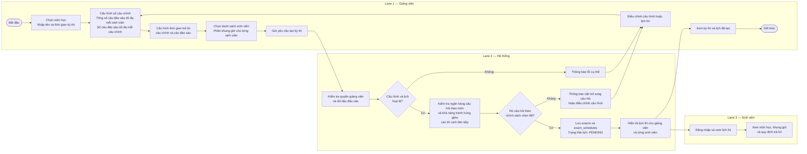
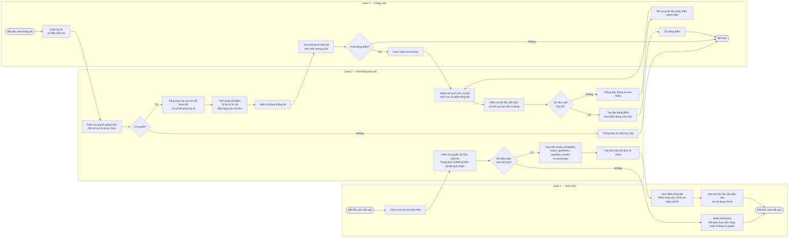

# Tài liệu nghiệp vụ — Hệ thống thi vấn đáp bằng AI

Tài liệu này mô tả luồng nghiệp vụ của hệ thống theo từng nhóm chức năng: quản lý kỳ thi và lịch thi, lõi phỏng vấn AI, và phản hồi/báo cáo kết quả. Mỗi sơ đồ được trình bày theo dạng lane (làn) tương ứng với các vai trò tham gia.

## Mục lục

1. [Nhóm chức năng 2 — Quản lý kỳ thi và lịch thi](#1-nhóm-chức-năng-2--quản-lý-kỳ-thi-và-lịch-thi)
2. [Nhóm chức năng 3 — Lõi phỏng vấn AI](#2-nhóm-chức-năng-3--lõi-phỏng-vấn-ai)
3. [Nhóm chức năng 6 — Phản hồi và báo cáo](#3-nhóm-chức-năng-6--phản-hồi-và-báo-cáo)
4. [Những điểm cần lưu ý khi đối chiếu với schema](#4-những-điểm-cần-lưu-ý-khi-đối-chiếu-với-schema)

---

## 1. Nhóm chức năng 2 — Quản lý kỳ thi và lịch thi

**Các lane:** Giảng viên, Hệ thống, Sinh viên

**Mục tiêu:** Tạo kỳ thi theo môn học, cấu hình số lượng câu hỏi và thời gian, phân lịch cho sinh viên, chuẩn bị chính sách chọn câu hỏi tránh trùng giữa các thí sinh liên tiếp.

### Quy tắc nghiệp vụ

- Mỗi sinh viên chỉ có một lịch thi trong một kỳ thi, tương ứng `UNIQUE (exam_id, student_id)`.
- Khung giờ mỗi sinh viên phải nằm trong thời gian của kỳ thi. Kiểm tra chồng lịch theo chính sách tổ chức thi ở tầng ứng dụng.
- Khi bắt đầu hoặc tiếp tục lượt thi, hệ thống chọn câu chính theo môn học:
  - Loại các câu đã dùng trong chính lượt thi đó.
  - Loại hoặc hạn chế các câu của thí sinh thi ngay trước theo chính sách chống trùng.
  - Chọn ngẫu nhiên hoặc thích ứng theo mức độ khó và kết quả trả lời hiện tại.
- Câu hỏi thực tế được ghi vào `exam_questions` khi được chọn. Luồng này được thể hiện trong sơ đồ ở Mục 2.

> **Lưu ý:** Schema có dữ liệu để tra lịch sử câu hỏi, nhưng chưa có cột lưu chế độ chọn đề hoặc mức độ chống trùng. Nếu cho phép giảng viên cấu hình các lựa chọn này, cần bổ sung nơi lưu cấu hình.

---

## 2. Nhóm chức năng 3 — Lõi phỏng vấn AI

**Các lane:** Sinh viên, Hệ thống điều phối thi, Dịch vụ AI

**Mục tiêu:** Thực hiện vấn đáp bằng giọng nói, chuyển lời nói thành văn bản gần thời gian thực, sinh câu hỏi đào sâu theo nội dung trả lời và chấm điểm.

```mermaid
flowchart LR
    subgraph SV["Lane 1 — Sinh viên"]
        direction TB
        A([Bắt đầu])
        B["Mở lịch thi<br/>Yêu cầu bắt đầu"]
        C["Nhận thông báo<br/>chưa đủ điều kiện vào thi"]
        D["Nghe câu hỏi"]
        E["Trả lời bằng giọng nói<br/>Kết thúc trả lời hoặc hết giờ"]
        F["Nhận thông báo hoàn tất lượt thi"]
        Z([Kết thúc])
    end

    subgraph HT["Lane 2 — Hệ thống điều phối thi"]
        direction TB
        G["Kiểm tra danh tính, lịch thi<br/>khung giờ và trạng thái"]
        H{"Được phép<br/>bắt đầu?"}
        I["Cập nhật IN_PROGRESS<br/>Ghi actual_start_time"]
        J{"Còn thời gian lượt thi<br/>và chưa đủ số câu chính?"}
        K["Chọn câu chính ngẫu nhiên hoặc thích ứng<br/>Loại câu đã dùng trong lượt thi<br/>và câu cần tránh từ thí sinh liền trước"]
        L["Lưu exam_questions: MAIN<br/>Nội dung chụp tại thời điểm chọn<br/>Trạng thái SELECTED"]
        M["Phát âm thanh câu hỏi<br/>Ghi transcript AI và asked_at<br/>Chuyển trạng thái ASKED"]
        N["Mở thu âm và đặt answer_deadline_at<br/>theo giới hạn câu hỏi và thời gian còn lại"]
        O["Hiển thị bản STT tạm thời<br/>Chốt transcript STUDENT khi kết thúc<br/>Đánh dấu is_final = true"]
        P["Cập nhật ANSWERED hoặc TIMED_OUT<br/>Ghi answered_at nếu có câu trả lời"]
        Q{"Cần hỏi thêm, còn thời gian<br/>và chưa chạm cả hai<br/>giới hạn đào sâu?"}
        R["Lưu exam_questions: FOLLOW_UP<br/>Liên kết câu chính qua parent_exam_question_id<br/>Tăng bộ đếm đào sâu"]
        S["Lưu question_results cho câu MAIN<br/>ai_score, max_score, ai_feedback"]
        T["Tổng hợp điểm thang 10<br/>Lưu final_score và actual_end_time<br/>Cập nhật COMPLETED"]
    end

    subgraph AI["Lane 3 — Dịch vụ AI: TTS, STT và LLM"]
        direction TB
        U["TTS: chuyển nội dung câu hỏi<br/>thành giọng nói"]
        V["STT: chuyển âm thanh thành văn bản<br/>gần thời gian thực"]
        W["Phân tích câu trả lời trong ngữ cảnh<br/>Phát hiện thiếu ý, mơ hồ hoặc mâu thuẫn<br/>Đề xuất có cần hỏi thêm"]
        X["Sinh câu hỏi đào sâu<br/>dựa trên câu trả lời và lịch sử trao đổi"]
        Y["Chấm câu chính theo tiêu chí đánh giá<br/>Sử dụng câu trả lời chính và đào sâu<br/>làm bằng chứng"]
    end

    A --> B --> G --> H
    H -- Không --> C --> Z
    H -- Có --> I --> J
    J -- Có --> K --> L --> U
    U --> M --> D --> N
    N --> E --> V --> O --> P --> W --> Q
    Q -- Có --> X --> R --> U
    Q -- Không --> Y --> S --> J
    J -- Không --> T --> F --> Z
```

### Điều kiện cho phép hỏi đào sâu

Hệ thống chỉ sinh câu hỏi đào sâu khi đồng thời đáp ứng:

1. AI đánh giá cần làm rõ câu trả lời
2. **AND** số câu đào sâu của câu chính hiện tại `< max_followups_per_main`
3. **AND** tổng số câu đào sâu trong lượt thi `< max_followup_questions`
4. **AND** lượt thi còn thời gian

### Quy ước xử lý

- Bộ đếm đào sâu của từng câu chính được đặt lại khi chuyển sang câu chính mới.
- Bộ đếm đào sâu toàn lượt thi được giữ xuyên suốt phiên.
- Mỗi câu `FOLLOW_UP` trỏ về câu `MAIN` tương ứng, kể cả khi hỏi sâu qua nhiều lượt.
- Khi hết thời gian trả lời, hệ thống chốt phần STT đã thu được và đánh dấu `TIMED_OUT`; nếu chưa có lời nói, dùng bằng chứng trả lời rỗng theo quy tắc chấm.
- Khi hết thời gian toàn lượt thi, không tạo thêm câu hỏi; hệ thống chấm phần đã thực hiện rồi kết thúc.
- Theo định hướng trong schema, câu đào sâu là bằng chứng bổ sung cho điểm câu chính, không tự cộng điểm riêng.

### Ánh xạ dữ liệu

| Dữ liệu | Bảng/cột |
|---|---|
| Giới hạn số câu và thời gian | `exams` |
| Trạng thái và thời gian lượt thi | `exam_schedules` |
| Câu chính, câu đào sâu, thứ tự, deadline | `exam_questions` |
| Hội thoại AI/sinh viên, kết quả STT | `transcripts` |
| Điểm và nhận xét từng câu chính | `question_results` |
| Điểm tổng kết | `exam_schedules.final_score` |

---

## 3. Nhóm chức năng 6 — Phản hồi và báo cáo

**Các lane:** Sinh viên, Hệ thống báo cáo, Giảng viên

**Mục tiêu:** Sinh viên xem kết quả cá nhân; giảng viên xem thống kê của kỳ thi và xuất bảng điểm theo mẫu trường.

### Quy tắc thống kê đề xuất

Vì SQL chưa định nghĩa công thức chấm tổng hoặc ngưỡng "trả lời tốt", các quy tắc dưới đây cần được nhóm thống nhất:

| Chỉ số | Cách tính đề xuất |
|---|---|
| Điểm tổng kết thang 10 | `10 × SUM(ai_score) / SUM(max_score)` trên các câu chính thuộc phạm vi chấm |
| Tỷ lệ trả lời tốt | Số kết quả có `ai_score / max_score ≥ ngưỡng` chia tổng số kết quả hợp lệ |
| Câu hỏi khó nhất | Câu có điểm chuẩn hóa trung bình thấp nhất; hiển thị kèm số lượt được hỏi |
| Phân bố điểm | Đếm sinh viên theo các khoảng điểm tổng kết đã thống nhất |
| Bảng điểm | Mã sinh viên, họ tên, mã môn, tên môn, kỳ thi, điểm tổng kết |

> Đối với câu chưa được hỏi hoặc chưa được chấm, cần quy định rõ cách xử lý trước khi tính điểm tổng để tránh vô tình nâng điểm do thiếu mẫu số.

---

## 4. Những điểm cần lưu ý khi đối chiếu với schema

1. **"Toàn lớp" hiện tương ứng danh sách sinh viên trong một kỳ thi.**
   `classes` và `class_students` mới là đoạn SQL được comment, chưa phải bảng thực tế. Muốn báo cáo theo lớp học phần qua nhiều kỳ thi cần triển khai phần này và liên kết lớp với kỳ thi.

2. **Chống trùng giữa các sinh viên liên tiếp là logic ứng dụng.**
   Index `uq_exam_main_source_question` chỉ ngăn lặp câu chính trong cùng một lượt thi. Hệ thống phải truy vấn lịch sử để tránh trùng giữa các lượt.

3. **Một số quy tắc cần kiểm tra thêm ở tầng ứng dụng.**
   Ví dụ: câu hỏi thuộc đúng môn của kỳ thi, lịch nằm trong thời gian kỳ thi, câu cha của `FOLLOW_UP` phải là `MAIN`, transcript phải thuộc đúng lượt thi của câu hỏi.

4. **Tiêu chí chấm và mẫu xuất chưa được lưu trong schema.**
   Workflow có thể dùng cấu hình ứng dụng; nếu giảng viên được quản lý tiêu chí chấm hoặc mẫu xuất, cần bổ sung cấu trúc lưu trữ phù hợp.
