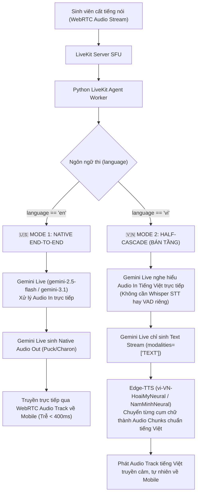
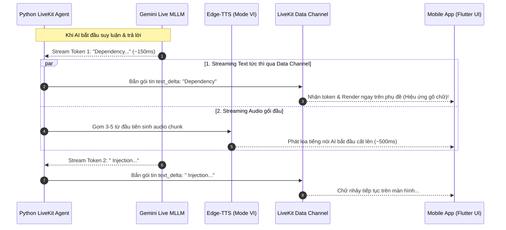

# 🏗️ TÀI LIỆU THIẾT KẾ KIẾN TRÚC & KẾ HOẠCH TRIỂN KHAI BACKEND (V3.0 - MASTER)
## HỆ THỐNG KHẢO THÍ VẤN ĐÁP AI TRỰC TUYẾN (AIVES - SWD392)
> **Dành cho:** Senior Backend Engineer / Technical Lead / AI Engineer  
> **Phiên bản CSDL:** `db_final.sql` (PostgreSQL 16)  
> **Công nghệ lõi:** Java 21 (Spring Boot 3.3.x Gateway & Business Logic) • LiveKit WebRTC Server (Open-source Real-time Media Engine) • Python 3.11 (LiveKit Agents & Gemini Live MLLM) • Flutter Mobile (Sinh viên thi) • React Web (Quản trị & Giảng viên chấm thi)  
> **Phạm vi trọng tâm:** Core 2 (Kỳ thi/Lịch thi/Bốc đề) • Core 3 (Lõi vấn đáp AI WebRTC Real-time & Streaming Text) • Core 6 (Báo cáo/Điểm/Xuất Excel) • Core 7 (Quản trị/Phân công/Đa ngữ)

---

## 1. TỔNG QUAN HỆ THỐNG & ĐỊNH HƯỚNG KIẾN TRÚC V3.0

### 1.1. Phân định Vai trò Nền tảng (Platform Separation of Roles)
Hệ thống AIVES phân tách dứt khoát giữa 2 nền tảng người dùng:
* **📱 Mobile App (Flutter) — Dành riêng cho SINH VIÊN (Student Exam App):**
  * Nơi **DUY NHẤT** tổ chức phòng thi vấn đáp trực tuyến (Core 3).
  * Kết nối trực tiếp vào **LiveKit WebRTC Server** qua `livekit_client` SDK: Thừa hưởng khả năng khử tiếng vang (AEC), chống ồn (NS), tự động bù gói tin mất (PLC) và độ trễ âm thanh siêu thấp (< 300ms).
  * Giao diện trực quan: Sóng âm thanh động (Audio Orb), đồng hồ đếm ngược, live transcript thời gian thực từ LiveKit Data Channel.
  * Xem lịch thi cá nhân và xem báo cáo kết quả / điểm AI / nhận xét sau khi hoàn thành ca thi (Core 6).
* **💻 Web Portal (React) — Dành riêng cho GIẢNG VIÊN & ADMIN (Management & Grading Portal):**
  * **Admin:** Quản trị tài khoản, danh mục môn học, phân công giảng viên phụ trách môn học (Core 7).
  * **Giảng viên:** Soạn đề thi, cấu hình ca thi, đặt giới hạn thời gian và số câu hỏi xoáy (Core 2).
  * **Bàn chấm thi & Giám sát (Grading & Proctoring Desk - Human-in-the-loop):** Giám sát trạng thái thí sinh online (`is_connected`), nghe lại audio từng câu/toàn ca thi thông qua LiveKit Recording/Egress, duyệt và điều chỉnh điểm AI đề xuất (`lecturer_score`).
  * **Báo cáo & Thống kê:** Phân tích phổ điểm lớp, tỷ lệ đạt/trượt và xuất file Excel bảng điểm chuẩn mẫu Đại học FPT (Core 6).

---

### 1.2. So sánh Kiến trúc: Truyền thống (Pipeline rời rạc) vs Kiến trúc Mới (LiveKit + Gemini Live)

Nhằm tối ưu hóa công sức triển khai đồ án, loại bỏ việc bảo trì nhiều module rời rạc dễ lỗi gãy luồng, hệ thống chuyển dịch sang kiến trúc **LiveKit WebRTC + Gemini Live MLLM**:

| Tiêu chí | Cách cũ: Pipeline rời rạc (VAD + Whisper + Gemini + Edge-TTS) | Cách mới: LiveKit WebRTC + Gemini Live MLLM |
| :--- | :--- | :--- |
| **Giao thức âm thanh** | WebSocket tự chế (Raw PCM 16kHz) $\leftrightarrow$ Spring Boot $\leftrightarrow$ gRPC $\leftrightarrow$ Python | Chuẩn công nghiệp **WebRTC** qua **LiveKit Server** (Opus codec, chống mất gói, độ trễ < 300ms) |
| **Xử lý VAD & Ngắt câu** | Phải cấu hình thủ công Silero VAD / WebRTCVAD bằng code Python, dễ lệch ngưỡng | Tích hợp sẵn trong Gemini Live / LiveKit Server VAD, tự động nhận diện lượt nói chính xác |
| **Xử lý STT (Speech-to-Text)**| Bắt buộc dùng Whisper (Groq/Faster-Whisper), tốn thêm 1 chặng mạng và thời gian xử lý | **Bỏ hoàn toàn STT riêng**: Gemini Live nhận trực tiếp sóng âm (Audio In), hiểu nghĩa ngay |
| **Khả năng ngắt lời (Interruption)** | Rất phức tạp (phải viết logic hủy phát audio khi user cất tiếng) | **Hỗ trợ native**: Khi thí sinh cất tiếng nói chen ngang, LiveKit & Gemini tự dừng phát câu trước |
| **Streaming Text thời gian thực** | Phải tự code WebSocket bắn từng chữ về Mobile | Tích hợp sẵn qua **WebRTC Data Channel** (SCTP Protocol siêu tốc độ) |
| **Độ phức tạp mã nguồn (LOC)**| ~1.200 dòng code (WebSocket Gateway, gRPC Protobuf, Buffer pooling, Stream coordinator) | **~100 - 150 dòng code Python** sử dụng `livekit-agents[google]` |
| **Độ ổn định mạng** | Dễ vỡ tiếng khi mạng 4G/WiFi chập chờn | WebRTC thích ứng băng thông động (Adaptive Bitrate) |
| **Chi phí Demo Local** | Phụ thuộc GPU/API riêng lẻ | **0 VNĐ** (LiveKit Docker local `--dev` + Google AI Studio Free Tier + Edge-TTS free) |

#### Đánh giá Ưu & Nhược điểm:
* **Ưu điểm kiến trúc LiveKit:**
  1. Giảm **70% khối lượng code hạ tầng**: Không cần tự viết streaming gRPC giữa Java và Python.
  2. Tốc độ phản hồi tức thì (Perceived Latency < 400ms).
  3. Cơ chế ngắt lời (Interruption) hoạt động tự nhiên như người thật nói chuyện.
  4. Mở rộng dễ dàng: Hỗ trợ thêm tính năng Camera giám sát cử chỉ thí sinh (`video_input=True`) mà không cần đổi kiến trúc.
* **Nhược điểm & Cách giải quyết:**
  * *Nhược điểm:* Giọng phát âm tiếng Việt native của Gemini Live hiện tại còn lơ lớ (chất giọng người nước ngoài).
  * *Cách giải quyết:* Sử dụng **Kiến trúc Nửa tầng (Half-Cascade)** cho Mode Tiếng Việt: Gemini Live Audio In $\rightarrow$ Gemini Text Stream $\rightarrow$ Edge-TTS `vi-VN-HoaiMyNeural` phát âm chuẩn giọng Việt tự nhiên 100%.

---

## 2. PHÂN ĐỊNH RẠCH RÒI TRÁCH NHIỆM GIỮA JAVA VÀ PYTHON

```mermaid
flowchart LR
    subgraph JAVA_BE [Java Spring Boot 3.3.x]
        direction TB
        J1["Quản trị Auth, Người dùng & Môn học (Core 7)"]
        J2["Soạn đề thi & Bốc thăm câu hỏi (Core 2)"]
        J3["Sinh LiveKit Access Token cho Mobile"]
        J4["Nhận Webhook từ LiveKit (is_connected)"]
        J5["Transactional Save: transcripts & question_results"]
        J6["Bàn chấm thi Giảng viên & Xuất Excel FPT (Core 6)"]
    end

    subgraph WEBRTC [LiveKit WebRTC Server]
        LK["SFU Room: exam-{scheduleId}<br>WebRTC Audio Track + Data Channel"]
    end

    subgraph PYTHON_AGENT [Python 3.11 LiveKit Worker]
        direction TB
        P1["Agent tự động Join Room khi SV vào phòng"]
        P2["Lấy đề thi & context từ Java Backend"]
        P3["Điều phối Hội thoại: Đọc đề, Lắng nghe, Ngắt lời"]
        P4["Adaptive Follow-up (Hỏi xoáy thích ứng theo expected_answer)"]
        P5["Streaming Text qua Data Channel (Hiệu ứng gõ chữ)"]
        P6["Auto-Grading Evaluator (Chấm điểm thang 10 & Feedback)"]
        P7["Submit kết quả ca thi về Java Backend"]
    end

    JAVA_BE -->|Cấp Token WebRTC| WEBRTC
    WEBRTC <==>|Audio 2 chiều & Data Channel| PYTHON_AGENT
    PYTHON_AGENT -->|Lấy đề thi / Nộp kết quả| JAVA_BE
```



| Nghiệp vụ | Trách nhiệm Java Spring Boot | Trách nhiệm Python LiveKit Agent |
| :--- | :--- | :--- |
| **Xác thực & Phân quyền** | Xử lý JWT Login, phân quyền STUDENT / LECTURER / ADMIN. | Không xử lý auth trực tiếp; nhận `scheduleId` qua LiveKit Room metadata. |
| **Quản lý Đề thi & Bốc đề** | Bốc thăm ngẫu nhiên $N$ câu hỏi từ bảng `questions`, tạo bản ghi snapshot trong `assigned_questions`. | Gọi Java API lấy danh sách câu hỏi đã bốc kèm `expected_answer`. |
| **Khởi tạo Phòng thi WebRTC** | Đặt tên phòng `exam-{scheduleId}`, ký LiveKit Room Token với quyền publish/subscribe audio và data channel. | Không sinh token; nhận job từ LiveKit Server dispatch vào phòng. |
| **Xử lý Luồng Âm thanh & VAD** | **Không can thiệp** luồng âm thanh (loại bỏ hoàn toàn code gRPC audio cũ). | LiveKit SDK + Gemini Live tự xử lý VAD, Turn Detection và Audio Streaming. |
| **Hỏi xoáy Thích ứng (Core 3)** | Không tham gia thời gian thực. | So sánh câu trả lời của SV với `expected_answer`, đặt tối đa $K$ câu hỏi xoáy, quản lý `parent_transcript_id`. |
| **Streaming Text Phụ đề** | Không tham gia thời gian thực. | Bắn từng token văn bản qua **LiveKit Data Channel** để Mobile hiển thị hiệu ứng gõ chữ thời gian thực (~150ms). |
| **Chất giọng & Phát âm** | Không tham gia. | Mode EN: Gemini Live native voice. Mode VI: LiveKit stream text $\rightarrow$ Edge-TTS `vi-VN-HoaiMyNeural`. |
| **Chấm điểm & Nhận xét AI** | Cung cấp endpoint nhận payload chấm điểm; lưu vào CSDL trong 1 Transaction ACID. | Chạy Prompt Auto-Grading chấm điểm từng câu theo thang điểm 10 (`ai_score`), viết nhận xét (`ai_feedback`). |
| **Giám sát Trực tuyến (Proctoring)**| Nhận LiveKit Webhook cập nhật `exam_schedules.is_connected` real-time lên Web Giảng viên. | Gửi event trạng thái ca thi qua LiveKit Data Channel. |
| **Bàn chấm thi & Báo cáo (Core 6)**| Cung cấp giao diện Web cho Giảng viên nghe lại audio, xem transcript, chốt điểm (`lecturer_score`) và xuất file Excel FPT. | Không tham gia. |

---

## 3. KIẾN TRÚC 2 CHẾ ĐỘ VẤN ĐÁP & CƠ CHẾ STREAMING TEXT

### 3.1. Phân chia 2 Chế độ theo Ngôn ngữ (`exams.language`)



#### 🇺🇸 Mode 1: Tiếng Anh (English Viva Mode) — 100% Native Multimodal
* **Đặc điểm:** Không STT, không VAD riêng, không TTS ngoài.
* **Xử lý:** Audio In $\rightarrow$ Gemini Live $\rightarrow$ Native Audio Out (`Puck`, `Charon`, `Aoede`).
* **Độ trễ:** Tức thì (~300ms - 450ms), thí sinh có thể ngắt lời mượt mà, hỗ trợ `thinking_level` để suy luận hỏi xoáy.

#### 🇻🇳 Mode 2: Tiếng Việt (Vietnamese Viva Mode) — Kiến trúc Nửa tầng (Half-Cascade)
* **Đặc điểm:** 
  * Vẫn **loại bỏ được 2 khối gánh nặng** là **Silero VAD** và **Whisper STT** (Gemini Live nghe hiểu âm thanh tiếng Việt và thuật ngữ CNTT cực kỳ chuẩn).
  * Chặn đầu ra audio lơ lớ của Google bằng cách đặt `modalities=[Modality.TEXT]`.
  * Cắm **`Edge-TTS`** với giọng đọc `vi-VN-HoaiMyNeural` (Nữ ấm giọng Bắc) hoặc `vi-VN-NamMinhNeural` (Nam chuẩn giáo dục) để phát ra loa.
* **Độ trễ:** ~500ms - 700ms (vẫn đáp ứng tiêu chuẩn vàng < 800ms của đề tài). Giọng nói 100% tự nhiên như người Việt.

---

### 3.2. Cơ chế Streaming Text Thời gian thực (Live Transcription Stream qua Data Channel)

Hệ thống phân tách độc lập 2 luồng WebRTC:
1. **WebRTC Media Audio Track:** Dành riêng cho âm thanh giọng nói (Audio In/Out).
2. **WebRTC Data Channel (Low-latency SCTP Channel):** Dành riêng cho việc bắn text token theo thời gian thực từ Python Agent sang Mobile Flutter.



* **Trải nghiệm sinh viên:** Chữ trên màn hình bắt đầu "nhảy" ra ngay lập tức sau **150ms** (hiệu ứng typing), và sau **~500ms** thì loa điện thoại cất tiếng nói đọc đồng bộ theo chữ.
* **Cấu trúc gói tin Data Channel JSON (Client & Agent):**
  ```json
  {
    "event": "transcription_delta",
    "data": {
      "role": "AI",
      "question_order": 1,
      "is_followup": false,
      "delta": "Dependency Injection ",
      "full_text": "Dependency Injection là một design pattern..."
    }
  }
  ```
  Khi câu trả lời kết thúc, Agent gửi event `"transcription_final"` để Mobile chốt block phụ đề và ghi nhận thời lượng.

---

## 4. CHI TIẾT DỮ LIỆU CẦN LƯU TRỮ THEO `db_final.sql` SAU 1 SESSION

Dựa trên cấu trúc chuẩn tại [`database/db_final.sql`](file:///E:/Developer/STUDY/SWD/SWD392G5/database/db_final.sql), sau khi sinh viên hoàn thành ca thi, hệ thống cập nhật và lưu trữ 4 bảng:

### 4.1. Bảng `exam_schedules` (Cập nhật trạng thái ca thi)
* `status`: Chuyển từ `'IN_PROGRESS'` sang `'COMPLETED'`.
* `actual_end_time`: Thời điểm chính xác sinh viên hoàn thành buổi thi (`now()`).
* `final_score`: Điểm tổng kết do AI đề xuất (tính bằng trung bình cộng các `ai_score` của từng câu hỏi, thang điểm 10.0, làm tròn 2 chữ số thập phân).
* `is_connected`: Đặt về `false` khi sinh viên rời khỏi LiveKit room.
* `full_recording_url`: Đường dẫn file ghi âm toàn bộ ca thi (phục vụ giảng viên nghe lại).

### 4.2. Bảng `transcripts` (Lưu lịch sử hội thoại chi tiết)
Lưu toàn bộ từng lượt nói (dialogue turns) giữa Giám khảo AI và Sinh viên:
* `exam_schedule_id`: UUID của ca thi.
* `question_id`: UUID của câu hỏi chính mà lượt nói này thuộc về.
* `parent_transcript_id`: 
  * Nếu là câu hỏi chính hoặc câu trả lời đầu tiên: mang giá trị `NULL`.
  * Nếu là **câu hỏi xoáy (follow-up)** hoặc câu trả lời cho câu hỏi xoáy: tham chiếu đến `id` của câu trả lời trước đó (tạo thành cây đệ quy hỏi xoáy thích ứng).
* `role`: `'AI'` (Giám khảo) hoặc `'STUDENT'` (Sinh viên).
* `text_content`: Nội dung bằng chữ của câu nói (phiên âm từ Gemini Live hoặc văn bản do AI sinh).
* `transcript_type`: `'MAIN'` (câu hỏi/trả lời chính) hoặc `'FOLLOWUP'` (câu hỏi/trả lời hỏi xoáy).
* `speech_duration_ms`: Thời lượng phát biểu (mili-giây).
* `latency_ms`: Độ trễ phản hồi của hệ thống (mili-giây).

### 4.3. Bảng `question_results` (Lưu điểm và nhận xét từng câu)
Mỗi câu hỏi được bốc thăm trong ca thi sẽ có đúng 1 bản ghi kết quả:
* `exam_schedule_id`: UUID ca thi.
* `question_id`: UUID câu hỏi.
* `ai_score`: Điểm số do AI chấm theo thang điểm 10 (ví dụ: `8.50`).
* `max_score`: Mặc định `10.00`.
* `ai_feedback`: Đánh giá chi tiết của AI (Điểm mạnh đã nắm, điểm yếu/thiếu sót khi bị hỏi xoáy).
* `lecturer_score`: Khởi tạo giá trị `NULL` (chờ Giảng viên duyệt trên Web Portal).
* `lecturer_feedback`: Khởi tạo giá trị `NULL`.
* `graded_at`: Thời điểm AI hoàn thành việc chấm điểm.

---

## 5. DỮ LIỆU TRẢ VỀ CHO SINH VIÊN SAU KHI THI XONG (RESPONSE DTO)

Khi ca thi hoàn tất, Mobile App của sinh viên gọi API:  
`GET /api/mobile/results/{scheduleId}`

Payload JSON trả về:

```json
{
  "success": true,
  "data": {
    "scheduleId": "e2a1b3c4-5d6e-7f8a-9b0c-1d2e3f4a5b6c",
    "examTitle": "Thi Vấn Đáp Cuối Kỳ - Kiến trúc Phần mềm (SWD392)",
    "courseCode": "SWD392",
    "courseName": "Software Architecture and Design",
    "studentCode": "SE170123",
    "studentName": "Nguyễn Hoàng Nam",
    "status": "COMPLETED",
    "finalScore": 8.25,
    "actualStartTime": "2026-10-01T08:00:15Z",
    "actualEndTime": "2026-10-01T08:12:45Z",
    "durationMinutes": 12.5,
    "isGradedByLecturer": false,
    "questionResults": [
      {
        "questionOrder": 1,
        "questionId": "q1111111-2222-3333-4444-555555555555",
        "questionContent": "Trình bày nguyên lý Dependency Injection (DI) và phân biệt 3 loại DI phổ biến.",
        "aiScore": 8.5,
        "maxScore": 10.0,
        "aiFeedback": "Sinh viên nắm rất vững khái niệm loose coupling và giải thích rõ ràng Constructor Injection. Tuy nhiên khi được hỏi xoáy về trường hợp sử dụng Field Injection thì giải thích còn chưa nêu bật được nhược điểm trong Unit Test.",
        "conversation": [
          {
            "role": "AI",
            "type": "MAIN",
            "content": "Chào Nam, câu hỏi số 1 của em là: Trình bày nguyên lý Dependency Injection và phân biệt 3 loại DI phổ biến."
          },
          {
            "role": "STUDENT",
            "type": "MAIN",
            "content": "Dạ thưa thầy, Dependency Injection là design pattern giúp tách việc tạo dependency ra khỏi class sử dụng nó, có 3 loại là Constructor, Setter và Field Injection..."
          },
          {
            "role": "AI",
            "type": "FOLLOWUP",
            "content": "Vậy theo em, tại sao trong Spring Boot người ta khuyên không nên dùng Field Injection?"
          },
          {
            "role": "STUDENT",
            "type": "FOLLOWUP",
            "content": "Dạ vì Field Injection gây khó khăn khi viết Unit Test mock đối tượng ạ."
          }
        ]
      }
    ]
  }
}
```

---

## 6. DANH MỤC API BACKEND HOÀN CHỈNH

### Phân hệ Mobile (Sinh viên thi vấn đáp)
* `POST /api/mobile/auth/login`: Đăng nhập sinh viên.
* `GET /api/mobile/schedules/my-exams`: Danh sách ca thi cá nhân.
* `POST /api/mobile/viva/{scheduleId}/start`: Khởi tạo ca thi, bốc thăm câu hỏi, **cấp LiveKit Room Token** (`livekit_token`, `room_name`, `ws_url`).
* `GET /api/mobile/results/{scheduleId}`: Xem bảng điểm chi tiết và nhận xét của AI sau khi nộp bài.

### API Nội bộ Dành riêng cho Python Agent (Internal Ingestion API)
* `GET /api/internal/viva/{scheduleId}/context`: Trả về danh sách câu hỏi đã bốc thăm và đáp án mong đợi cho Python Agent.
* `POST /api/internal/viva/{scheduleId}/complete`: Python nộp toàn bộ kết quả ca thi (transcripts + question_results), Java lưu vào DB trong 1 `@Transactional`.

### Webhook Service (Xử lý sự kiện từ LiveKit Server)
* `POST /api/webhooks/livekit`: Nhận sự kiện từ LiveKit Server:
  * `participant_joined`: Cập nhật `exam_schedules.is_connected = true`.
  * `participant_left`: Cập nhật `exam_schedules.is_connected = false`.
  * `room_finished`: Xác nhận ca thi hoàn tất, đóng phòng.

### Phân hệ Web Giảng viên & Admin (Giữ nguyên nghiệp vụ Core 2, 6, 7)
* `GET /api/lecturer/exams`: Quản lý danh sách kỳ thi.
* `POST /api/lecturer/exams`: Tạo kỳ thi, chọn `language` (`vi` hoặc `en`), cấu hình số câu hỏi chính và số câu hỏi xoáy.
* `GET /api/lecturer/schedules/{examId}`: Giám sát danh sách thí sinh trong ca thi (xem online `is_connected`).
* `GET /api/lecturer/grading/{scheduleId}`: Bàn chấm thi: nghe lại audio, xem transcript, duyệt điểm AI.
* `PUT /api/lecturer/grading/{scheduleId}/finalize`: Giảng viên chốt điểm cuối cùng (`lecturer_score`).
* `GET /api/lecturer/exams/{examId}/export-excel`: Xuất file Excel bảng điểm chuẩn form Đại học FPT.
* `GET/POST /api/admin/courses/{courseId}/lecturers`: Quản trị phân công giảng viên phụ trách môn học.

---

### Component 2: Python LiveKit AI Worker (`python/`)

Tạo mới toàn bộ module Python LiveKit Agent với môi trường ảo **`uv venv`** độc lập:

#### 1. Khởi tạo môi trường ảo với `uv`
* Lệnh khởi tạo: `uv venv .venv`
* Kích hoạt và cài đặt gói: `uv pip install -r requirements.txt` (sử dụng cache siêu tốc của `uv`).
* [NEW] `python/requirements.txt`:
  ```text
  livekit-agents~=1.8.0
  livekit-plugins-google~=1.8.2
  edge-tts>=6.1.12
  requests>=2.31.0
  pydantic>=2.0.0
  python-dotenv>=1.0.0
  ```
* [NEW] `python/.env.example`: Chứa các biến môi trường mẫu (`LIVEKIT_URL`, `LIVEKIT_API_KEY`, `LIVEKIT_API_SECRET`, `GOOGLE_API_KEY`, `BACKEND_INTERNAL_URL`, `INTERNAL_API_KEY`).
* [NEW] `python/config.py`: Đọc và validate cấu hình từ `.env` bằng Pydantic Settings.

#### 2. Lõi Agent & 2 Chế độ (Mode EN & Mode VI)
* [NEW] `python/agent.py`: Điểm khởi chạy `AgentServer` lắng nghe phòng thi từ LiveKit.
* [NEW] `python/modes/english_agent.py`: Cấu hình Native Multimodal (`gemini-2.5-flash` / `gemini-3.1`, voice `Charon`/`Puck`).
* [NEW] `python/modes/vietnamese_agent.py`: Cấu hình Half-Cascade (Gemini Live Audio In $\rightarrow$ Text Stream $\rightarrow$ Edge-TTS `vi-VN-HoaiMyNeural`).
* [NEW] `python/services/backend_client.py`: Gọi REST API nội bộ của Java Backend để lấy context câu hỏi và nộp kết quả ca thi.
* [NEW] `python/services/tts_service.py`: Wrapper xử lý Edge-TTS streaming audio chunks cho tiếng Việt.
* [NEW] `python/prompts/viva_prompts.py`: Prompt giám khảo FPT, logic hỏi xoáy thích ứng.
* [NEW] `python/prompts/grader_prompts.py`: Prompt chấm điểm thang 10 và tạo feedback cho từng câu hỏi.

---

### Component 3: Tài liệu Hướng dẫn Tích hợp Client sang Backend (`docs/client_integration_guide.md`)

* [NEW] `docs/client_integration_guide.md`:
  * **Dành cho Mobile App (Flutter):**
    * Cài đặt thư viện `livekit_client: ^2.4.0`.
    * Luồng gọi `POST /api/mobile/viva/{scheduleId}/start` lấy `livekitToken` và `roomName`.
    * Kết nối WebRTC Room, publish microphone và subscribe audio track của Giám khảo AI.
    * Lắng nghe **LiveKit Data Channel** (`room.events.listen(...)`) nhận event `transcription_delta` để render chữ chạy từng từ thời gian thực trên màn hình (Live Subtitles).
    * Gọi `GET /api/mobile/results/{scheduleId}` hiển thị bảng điểm sau khi thi.
  * **Dành cho Web Portal (React):**
    * Gọi API Giảng viên lấy danh sách ca thi, trạng thái online real-time (`is_connected`).
    * Bàn chấm thi: Nghe lại audio recording, xem transcript, điều chỉnh điểm `lecturer_score` và gọi API chốt điểm.
    * Gọi API xuất file Excel bảng điểm FPT.

---

## 8. LỘ TRÌNH TRIỂN KHAI TINH GỌN (PHASES V3.0)

```
[Phase 1: DB & LiveKit Local Infrastructure (1 - 2 ngày)]
  ├── Chạy db_final.sql trên PostgreSQL Neon DB
  ├── Khởi chạy LiveKit Server local bằng Docker (--dev)
  └── Viết Java API cấp LiveKit Token (POST /api/mobile/viva/{id}/start)

[Phase 2: Xây dựng Python LiveKit Agent (2 - 3 ngày)]
  ├── Cài đặt livekit-agents và livekit-plugins-google
  ├── Hoàn thiện Mode 1 (Tiếng Anh - Native Audio)
  ├── Hoàn thiện Mode 2 (Tiếng Việt - Half-cascade với Edge-TTS)
  ├── Tích hợp Streaming Text qua LiveKit Data Channel
  └── Tích hợp logic hỏi xoáy thích ứng (Adaptive Follow-up)

[Phase 3: Tự động chấm điểm & Lưu trữ kết quả (1 - 2 ngày)]
  ├── AutoGrader trích xuất điểm và nhận xét vào bảng question_results
  ├── Java API Internal Transactional Save (transcripts + question_results)
  ├── Mobile hiển thị màn hình kết quả sau khi thi (GET /api/mobile/results/{id})
  └── Web Giảng viên: Bàn chấm thi nghe lại audio & xuất Excel FPT

[Phase 4: Tích hợp Mobile & Test kịch bản Demo (2 ngày)]
  ├── Kết nối Flutter Mobile (livekit_client) vào LiveKit Server
  └── Test tương tác hỏi đáp, streaming text, chen ngang ngắt lời và đóng gói demo
```
