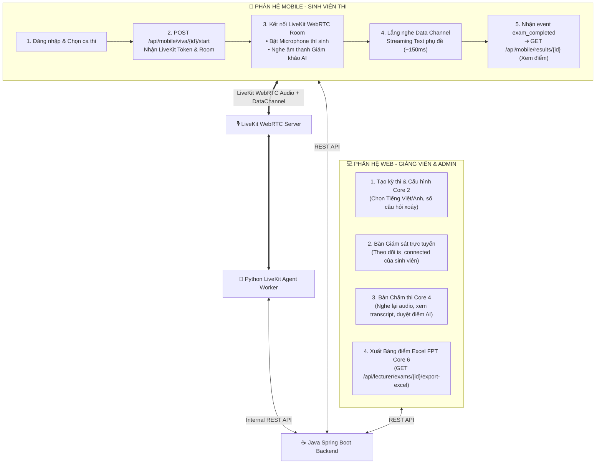

# 📱💻 HƯỚNG DẪN TÍCH HỢP CLIENT (FLUTTER MOBILE & REACT WEB) VỚI BACKEND (AIVES)
> **Dành cho:** Mobile Developer (Flutter) & Frontend Web Developer (React)  
> **Kiến trúc hệ thống:** Java Spring Boot 3.3.x • LiveKit WebRTC Server • Python LiveKit Agent • PostgreSQL 16  
> **Phiên bản:** V3.0 (Chuẩn hóa WebRTC & Streaming Text)

---

## 1. TỔNG QUAN LUỒNG KẾT NỐI TOÀN HỆ THỐNG



---

## 2. HƯỚNG DẪN TÍCH HỢP FLUTTER MOBILE (DÀNH CHO SINH VIÊN)

### 2.1. Cài đặt thư viện vào `pubspec.yaml`
```yaml
dependencies:
  flutter:
    sdk: flutter
  # Thư viện LiveKit WebRTC chính thức
  livekit_client: ^2.4.0
  # HTTP Client & Quản lý State
  http: ^1.2.0
  flutter_secure_storage: ^9.0.0
  provider: ^6.1.1
```

### 2.2. Cấp quyền Microphone trong Native App
* **Android (`android/app/src/main/AndroidManifest.xml`):**
  ```xml
  <uses-permission android:name="android.permission.RECORD_AUDIO" />
  <uses-permission android:name="android.permission.INTERNET" />
  <uses-permission android:name="android.permission.MODIFY_AUDIO_SETTINGS" />
  ```
* **iOS (`ios/Runner/Info.plist`):**
  ```xml
  <key>NSMicrophoneUsageDescription</key>
  <string>Ứng dụng cần quyền sử dụng Microphone để thực hiện phần thi vấn đáp trực tuyến.</string>
  ```

---

### 2.3. Quy trình 4 bước triển khai màn hình phòng thi (`VivaExamScreen`)

#### BƯỚC 1: Gọi API bắt đầu ca thi lấy Token LiveKit
Khi sinh viên bấm nút **"Bắt đầu thi"**, gọi Backend Java:
* **API:** `POST /api/mobile/viva/{scheduleId}/start`
* **Header:** `Authorization: Bearer <STUDENT_JWT_TOKEN>`
* **Response:**
  ```json
  {
    "success": true,
    "data": {
      "scheduleId": "e2a1b3c4-5d6e-7f8a-9b0c-1d2e3f4a5b6c",
      "roomName": "exam-e2a1b3c4-5d6e-7f8a-9b0c-1d2e3f4a5b6c",
      "livekitToken": "eyJhbGciOiJIUzI1NiIsInR5cCI6IkpXVCJ9...",
      "serverUrl": "ws://192.168.1.50:7880"
    }
  }
  ```

#### BƯỚC 2: Kết nối vào phòng LiveKit WebRTC
```dart
import 'dart:convert';
import 'package:flutter/material.dart';
import 'package:livekit_client/livekit_client.dart';

class LiveKitVivaService {
  Room? _room;
  EventsListener<RoomEvent>? _listener;

  // Callback trả về phụ đề text đang stream thời gian thực
  Function(String textDelta, bool isFollowup)? onTranscriptionDelta;
  Function(String fullText)? onTranscriptionFinal;
  Function()? onExamCompleted;

  Future<void> connectToExamRoom({
    required String serverUrl,
    required String token,
  }) async {
    _room = Room();
    _listener = _room!.createListener();

    // 1. Lắng nghe dữ liệu text stream qua LiveKit Data Channel
    _listener!.on<DataReceivedEvent>((event) {
      try {
        final rawString = utf8.decode(event.data);
        final jsonMsg = jsonDecode(rawString);

        if (jsonMsg['event'] == 'transcription_delta') {
          final delta = jsonMsg['data']['delta'] ?? '';
          final isFollowup = jsonMsg['data']['is_followup'] ?? false;
          if (onTranscriptionDelta != null) {
            onTranscriptionDelta!(delta, isFollowup);
          }
        } else if (jsonMsg['event'] == 'transcription_final') {
          final fullText = jsonMsg['data']['full_text'] ?? '';
          if (onTranscriptionFinal != null) {
            onTranscriptionFinal!(fullText);
          }
        } else if (jsonMsg['event'] == 'exam_completed') {
          if (onExamCompleted != null) {
            onExamCompleted!();
          }
        }
      } catch (e) {
        debugPrint('Lỗi giải mã gói tin DataChannel: $e');
      }
    });

    // 2. Kết nối phòng WebRTC
    await _room!.connect(serverUrl, token);

    // 3. Bật Microphone của thí sinh
    await _room!.localParticipant?.setMicrophoneEnabled(true);
  }

  Future<void> disconnect() async {
    await _listener?.dispose();
    await _room?.disconnect();
    await _room?.dispose();
  }
}
```

#### BƯỚC 3: Giao diện Streaming Text phụ đề nhảy từng từ (Live Typing Effect)
Trong `StatefulWidget` của màn hình thi:
```dart
String _currentStreamingSubtitle = "";

@override
void initState() {
  super.initState();
  _vivaService.onTranscriptionDelta = (delta, isFollowup) {
    setState(() {
      // Append mẩu token vừa bắn về (Hiệu ứng chữ nhảy liên tục)
      _currentStreamingSubtitle += delta;
    });
  };

  _vivaService.onTranscriptionFinal = (fullText) {
    setState(() {
      _currentStreamingSubtitle = fullText;
    });
  };

  _vivaService.onExamCompleted = () {
    // Chuyển sang màn hình Báo cáo kết quả
    Navigator.pushReplacementNamed(context, '/exam-result', arguments: widget.scheduleId);
  };
}
```

#### BƯỚC 4: Lấy bảng điểm chi tiết sau khi thi xong
* **API:** `GET /api/mobile/results/{scheduleId}`
* **Dữ liệu hiển thị:** Điểm trung bình `finalScore`, nhận xét `aiFeedback`, điểm từng câu hỏi và danh sách câu hỏi xoáy đã trả lời.

---

## 3. HƯỚNG DẪN TÍCH HỢP REACT WEB (DÀNH CHO GIẢNG VIÊN & ADMIN)

### 3.1. Các Phân hệ trên Web Portal
1. **Core 7 (Admin):** Quản trị môn học và phân công giảng viên (`/api/admin/courses/{id}/lecturers`).
2. **Core 2 (Giảng viên):** Soạn đề thi và cấu hình kỳ thi:
   * Chọn `language`: `'vi'` (Tiếng Việt - Half-Cascade) hoặc `'en'` (Tiếng Anh - Native Multimodal).
   * Cấu hình: `max_main_questions` (số câu chính), `max_followups_per_main` (số lần hỏi xoáy tối đa mỗi câu), `main_answer_time_limit_seconds`.
3. **Core 4 (Giảng viên):** Bàn Giám sát trực tuyến & Bàn Chấm thi (Human-in-the-loop).
4. **Core 6 (Giảng viên):** Báo cáo phổ điểm & Xuất Excel chuẩn FPT.

---

### 3.2. Màn hình Bàn Giám sát Trực tuyến (Proctoring Desk)
* **API:** `GET /api/lecturer/schedules/{examId}`
* **Dữ liệu render:**
  ```typescript
  interface CandidateStatus {
    scheduleId: string;
    studentCode: string;
    studentName: string;
    status: 'PENDING' | 'IN_PROGRESS' | 'COMPLETED';
    isConnected: boolean; // TRUE: Đang kết nối WebRTC; FALSE: Mất mạng/Chưa vào
    actualStartTime: string;
  }
  ```
* **UI Indicator:** Hiển thị Badge xanh lá `Online` nếu `isConnected === true`, màu xám/đỏ nếu `false`. Trạng thái này được cập nhật theo thời gian thực nhờ LiveKit Webhook phía Backend.

---

### 3.3. Màn hình Bàn Chấm thi & Duyệt điểm (Grading Desk)
Khi giảng viên bấm vào một ca thi đã hoàn thành:
* **API lấy dữ liệu:** `GET /api/lecturer/grading/{scheduleId}`
* **Response:**
  ```json
  {
    "scheduleId": "e2a1b3c4-...",
    "studentCode": "SE170123",
    "studentName": "Nguyễn Hoàng Nam",
    "finalScore": 8.25,
    "fullRecordingUrl": "https://storage.aives.fpt.edu.vn/recordings/exam-e2a1b3c4.mp4",
    "questionResults": [
      {
        "questionId": "q1",
        "questionContent": "Trình bày nguyên lý Dependency Injection...",
        "aiScore": 8.5,
        "aiFeedback": "Nắm vững loose coupling, giải thích tốt Constructor Injection...",
        "lecturerScore": null,
        "lecturerFeedback": null,
        "transcripts": [
          { "role": "AI", "text": "Câu hỏi số 1 của em là...", "type": "MAIN" },
          { "role": "STUDENT", "text": "Dạ Dependency Injection là...", "type": "MAIN" },
          { "role": "AI", "text": "Tại sao không nên dùng Field Injection?", "type": "FOLLOWUP" },
          { "role": "STUDENT", "text": "Dạ vì khó mock trong Unit Test ạ.", "type": "FOLLOWUP" }
        ]
      }
    ]
  }
  ```

#### Form Chốt điểm của Giảng viên:
Giảng viên có quyền nghe lại Audio, đọc Transcript và ghi đè điểm nếu thấy AI chấm quá khắt khe hoặc quá lỏng:
* **API lưu điểm:** `PUT /api/lecturer/grading/{scheduleId}/finalize`
* **Payload:**
  ```json
  {
    "lecturerScore": 9.0,
    "lecturerFeedback": "Sinh viên trả lời lưu loát, phản biện câu hỏi xoáy rất tốt. Cộng thêm 0.5 điểm khuyến khích.",
    "questionsOverride": [
      { "questionId": "q1", "lecturerScore": 9.0 }
    ]
  }
  ```

---

### 3.4. Xuất Bảng điểm Excel Chuẩn Form Đại học FPT
* **Nút bấm:** "Xuất Excel Bảng Điểm"
* **API:** `GET /api/lecturer/exams/{examId}/export-excel`
* **Response:** File nhị phân định dạng `.xlsx`.
* **Cấu trúc cột:**
  | STT | Mã sinh viên | Họ và tên | Điểm Vấn Đáp (0 - 10) | Giảng viên chấm | Trạng thái | Ghi chú |
  | :---: | :---: | :---: | :---: | :---: | :---: | :---: |
  | 1 | SE170123 | Nguyễn Hoàng Nam | 9.0 | Thầy Hoàng | COMPLETED | AI: 8.5 (GV điều chỉnh) |

---

## 4. TỔNG HỢP DANH MỤC API THEO NỀN TẢNG

| Nền tảng | Endpoint | Method | Mục đích |
| :--- | :--- | :---: | :--- |
| **Mobile** | `/api/mobile/auth/login` | POST | Đăng nhập sinh viên nhận JWT |
| **Mobile** | `/api/mobile/schedules/my-exams` | GET | Xem danh sách ca thi được phân công |
| **Mobile** | `/api/mobile/viva/{id}/start` | POST | Bốc thăm câu hỏi & nhận LiveKit Room Token |
| **Mobile** | `/api/mobile/results/{id}` | GET | Xem kết quả điểm số & nhận xét sau khi thi |
| **Web** | `/api/lecturer/exams` | GET/POST | Quản lý & Tạo kỳ thi (Cấu hình Tiếng Việt/Anh, hỏi xoáy) |
| **Web** | `/api/lecturer/schedules/{examId}` | GET | Giám sát trạng thái online `isConnected` của ca thi |
| **Web** | `/api/lecturer/grading/{id}` | GET | Bàn chấm thi: Nghe audio, xem transcript & điểm AI |
| **Web** | `/api/lecturer/grading/{id}/finalize` | PUT | Giảng viên ghi đè & chốt điểm chính thức |
| **Web** | `/api/lecturer/exams/{id}/export-excel`| GET | Tải file Excel bảng điểm chuẩn form FPT |
| **Admin** | `/api/admin/courses/{id}/lecturers` | GET/POST | Phân công giảng viên phụ trách môn học (Core 7) |
