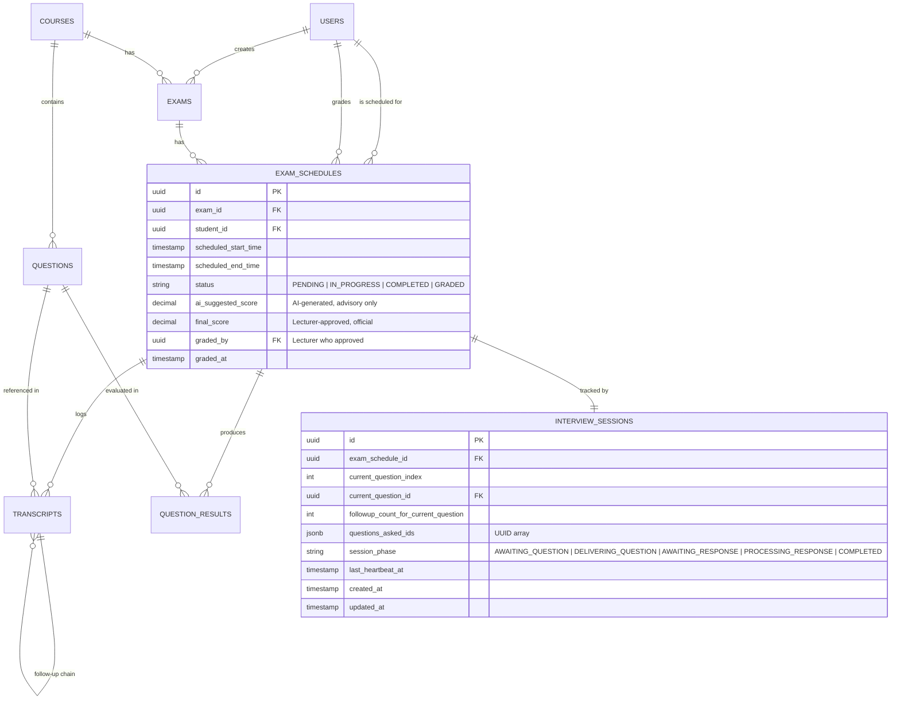

# AIVES — Implementation Task List (v2 — Revised)
> **Scope:** Module 2 (Exam & Schedule Management) · Module 3 (AI Interview Core) · Module 6 (Feedback & Reporting)  
> **Stack:** Spring Boot 3 · React 18 · PostgreSQL 16 · WebSocket (STOMP) · REST  
> **Architecture:** Modular Monolith (one deployable, three logical modules)  
> **Revision:** v2 — Incorporates Human-in-the-Loop governance, audio ingestion redesign, and session resilience fixes.

> [!IMPORTANT]
> Tasks marked `[NEW]` are additions from the architectural review.  
> Tasks marked `[UPDATED]` have been modified from v1.  
> Unmarked tasks are unchanged from v1.

---

## 1. Backend Implementation (Spring Boot & PostgreSQL)

### 1.1 Project Bootstrap & Shared Infrastructure

- [ ] Initialize Spring Boot 3 project (`back-end/`) with Gradle/Maven — modules: `web`, `data-jpa`, `websocket`, `validation`, `security`, `lombok`.
- [ ] Configure PostgreSQL datasource, Flyway/Liquibase for schema migrations, and `application.yml` profiles (`dev`, `test`, `prod`).
- [ ] Define shared base entity (`BaseEntity`: `id UUID`, `createdAt`, `updatedAt`) and auditing config (`@EnableJpaAuditing`).
- [ ] Set up global exception handler (`@RestControllerAdvice`) with a standard `ApiResponse<T>` envelope.
- [ ] Configure Spring Security with JWT authentication and role-based access (`ADMIN`, `LECTURER`, `STUDENT`).
- [ ] Set up async executor (`@EnableAsync`, `ThreadPoolTaskExecutor`) for post-exam processing events.
- [ ] `[NEW]` Configure `MultipartResolver` with max file size (e.g. 10MB) for audio blob uploads.

### 1.2 Database Migrations & Core Entities

Write Flyway migration scripts (`V1__*.sql` → `V8__*.sql`) and matching JPA entities for each table:

| # | Migration | Entity Class | Key Fields | Status |
|---|-----------|-------------|------------|--------|
| 1 | `V1__create_users.sql` | `User` | `id`, `username`, `passwordHash`, `fullName`, `role` (enum `ADMIN/LECTURER/STUDENT`) | |
| 2 | `V2__create_courses.sql` | `Course` | `id`, `courseCode`, `courseName` | |
| 3 | `V3__create_questions.sql` | `Question` | `id`, `courseId` (FK), `content`, `difficultyLevel` (enum `EASY/MEDIUM/HARD`) | |
| 4 | `V4__create_exams.sql` | `Exam` | `id`, `courseId` (FK), `title`, `startDate`, `endDate`, `maxMainQuestions`, `maxFollowupQuestions`, `createdBy` (FK) | |
| 5 | `V5__create_exam_schedules.sql` | `ExamSchedule` | `id`, `examId` (FK), `studentId` (FK), `scheduledStartTime`, `scheduledEndTime`, `status` (enum `PENDING/IN_PROGRESS/COMPLETED/GRADED`), `aiSuggestedScore`, `finalScore`, `gradedBy` (FK, nullable), `gradedAt` (TIMESTAMP, nullable) | **[UPDATED]** |
| 6 | `V6__create_transcripts.sql` | `Transcript` | `id`, `examScheduleId` (FK), `questionId` (FK, nullable), `parentTranscriptId` (FK, nullable), `role` (enum `AI/STUDENT`), `textContent`, `audioUrl`, `createdAt` | |
| 7 | `V7__create_question_results.sql` | `QuestionResult` | `id`, `examScheduleId` (FK), `questionId` (FK), `aiScore`, `aiFeedback` | |
| 8 | `V8__create_interview_sessions.sql` | `InterviewSession` | `id`, `examScheduleId` (FK, unique), `currentQuestionIndex`, `currentQuestionId` (FK, nullable), `followupCountForCurrentQuestion`, `questionsAskedIds` (UUID[], JSONB), `sessionPhase` (enum `AWAITING_QUESTION/DELIVERING_QUESTION/AWAITING_RESPONSE/PROCESSING_RESPONSE/COMPLETED`), `lastHeartbeatAt`, `createdAt`, `updatedAt` | **[NEW]** |

**Changes from v1:**

> [!WARNING]
> **`ExamSchedule` entity updated** — `finalScore` is now **lecturer-only writable**. AI populates `aiSuggestedScore`. New fields: `gradedBy`, `gradedAt`. New status value: `GRADED`.

> [!IMPORTANT]
> **`InterviewSession` entity added** — Persists interview progress to PostgreSQL so sessions survive browser reloads and server restarts. Replaces volatile in-memory-only `ConcurrentHashMap`.

- [ ] `[UPDATED]` Create JPA `@Entity` classes with proper `@ManyToOne`, `@OneToMany`, self-referencing (`parentTranscript`) relationships. Include `InterviewSession` entity with `@OneToOne` to `ExamSchedule`.
- [ ] Create Spring Data JPA `Repository` interfaces for each entity (including `InterviewSessionRepository`).

### 1.3 Module 2 — Exam & Schedule Management APIs

- [ ] **`POST /api/exams`** — Lecturer creates an exam linked to a course with question constraints.
- [ ] **`GET /api/exams`** — List exams (filtered by course, date range). Pagination via `Pageable`.
- [ ] **`GET /api/exams/{id}`** — Get exam details with associated schedules.
- [ ] **`PUT /api/exams/{id}`** — Update exam settings (dates, question limits).
- [ ] **`DELETE /api/exams/{id}`** — Soft-delete exam (only if no schedule is `IN_PROGRESS`).
- [ ] **`POST /api/exams/{examId}/schedules`** — Bulk-create timeslots for a student roster (accepts list of `{studentId, startTime, endTime}`).
- [ ] **`GET /api/exams/{examId}/schedules`** — List all student timeslots for an exam.
- [ ] `[UPDATED]` **`PATCH /api/schedules/{id}/status`** — Update schedule status transitions (`PENDING → IN_PROGRESS → COMPLETED → GRADED`). Transition to `GRADED` is blocked — use the dedicated grading endpoint instead.
- [ ] `[NEW]` **`PATCH /api/schedules/{id}/grade`** — **Lecturer-only** endpoint. Request body: `{ finalScore: number, lecturerNotes?: string }`. Validates: `COMPLETED` status required, authenticated user must be the exam's `createdBy` lecturer. Writes `finalScore`, `gradedBy`, `gradedAt`, transitions status to `GRADED`.
- [ ] `[NEW]` **`GET /api/exams/{examId}/schedules/pending-review`** — Returns all schedules in `COMPLETED` status (AI scored, awaiting lecturer review). Response includes `aiSuggestedScore`, transcript summary, and per-question AI scores for lecturer review.
- [ ] **Question Selection Service** — `QuestionSelector` with strategy interface:
  - `RandomQuestionSelector` — Shuffled random pick from course question bank, excluding questions already used in the same exam session (prevent duplicate questions across consecutive candidates).
  - `AdaptiveQuestionSelector` — (Phase 2) difficulty-weighted selection based on prior candidate performance.
- [ ] **Validation:** Guard constraints — `maxMainQuestions` ≤ total questions in course bank; timeslot overlap detection per student.

### 1.4 Module 3 — AI Interview Core (WebSocket + REST Audio)

#### 1.4.1 WebSocket Configuration (Signaling Only)

> [!IMPORTANT]
> **[UPDATED] Architecture change:** WebSocket (STOMP) is now used **only for signaling and event delivery** (server→client push). Audio data is transmitted via REST multipart upload (buffered mode) or optional gRPC streaming. This eliminates Base64 encoding overhead and simplifies audio handling.

- [ ] Enable `@EnableWebSocketMessageBroker` with STOMP over SockJS.
- [ ] Configure endpoints: `/ws/interview` (handshake), subscribe destinations: `/topic/session/{scheduleId}`.
- [ ] Implement `ChannelInterceptor` for JWT-based WebSocket authentication.
- [ ] `[UPDATED]` Define STOMP message DTOs — **signaling only, no audio payload:**
  - **Client → Server (STOMP `SEND`):**
    - `StartSessionCommand { scheduleId }` → dest: `/app/session/start`
    - `AnswerSubmittedSignal { scheduleId, audioUploadId }` → dest: `/app/session/answer-ready` — Notifies server that audio blob has been uploaded via REST.
    - `ResumeSessionCommand { scheduleId }` → dest: `/app/session/resume` **[NEW]**
  - **Server → Client (STOMP `MESSAGE`):**
    - `InterviewEvent { type, payload }` — types: `QUESTION_DELIVERED`, `FOLLOWUP_QUESTION`, `WAITING_FOR_RESPONSE`, `SESSION_COMPLETE`, `TRANSCRIPT_UPDATE`, `SESSION_RESTORED`, `ERROR`.

#### 1.4.2 Audio Ingestion — Dual Mode [NEW]

> [!TIP]
> **Default mode (Buffered STT):** Student records full answer → uploads complete audio blob via REST → server transcribes entire audio at once. Simpler, lower complexity, sufficient for viva exam format where turn-taking is explicit.  
> **Optional mode (Streaming STT):** For real-time partial transcription during recording. Requires gRPC integration.

##### Mode A: Buffered Audio Upload (Default — PoC Target)

- [ ] `[NEW]` **`POST /api/sessions/{scheduleId}/audio`** — REST endpoint accepting `multipart/form-data`:
  - Field: `audio` (file, `audio/webm;codecs=opus`).
  - Returns: `{ audioUploadId: UUID, audioUrl: string }`.
  - Server stores audio blob to local filesystem or object storage (S3/MinIO), saves URL to DB.
  - After upload completes, client sends `AnswerSubmittedSignal` via STOMP to trigger processing.
- [ ] `[NEW]` Backend processing flow on `AnswerSubmittedSignal`:
  1. Retrieve audio file by `audioUploadId`.
  2. **Transcode if needed:** If STT provider requires `LINEAR16`/`FLAC`, use `ffmpeg` (via `ProcessBuilder`) to convert from `webm/opus`. Skip if using Whisper (accepts webm natively).
  3. Call `SttProvider.transcribe(audioBytes, "vi-VN")`.
  4. Persist `Transcript` row (role=`STUDENT`, `textContent`, `audioUrl`).
  5. Proceed to `evaluateAndDecide()`.

##### Mode B: Streaming STT (Phase 2 — Optional)

- [ ] `[NEW]` Integrate Google Cloud Speech-to-Text **Streaming Recognize** via gRPC (`StreamObserver` pattern):
  - Frontend streams audio chunks as raw PCM/Opus over a dedicated binary WebSocket endpoint (`/ws/audio-stream/{scheduleId}`).
  - Backend pipes chunks to `SpeechClient.streamingRecognizeCallable()`.
  - Interim results pushed to client via STOMP `TRANSCRIPT_UPDATE` events for real-time subtitle display.
  - Final result triggers `evaluateAndDecide()`.
- [ ] `[NEW]` Add `@ConfigurationProperties(prefix = "aives.audio")` with `mode` property (`BUFFERED` | `STREAMING`), default: `BUFFERED`.

#### 1.4.3 Interview Session Orchestrator [UPDATED]

- [ ] `[UPDATED]` `InterviewSessionService` — Manages the lifecycle of a single viva session **with DB-backed state persistence:**
  1. **`startSession(scheduleId)`** — Marks `ExamSchedule` → `IN_PROGRESS`, creates `InterviewSession` row in DB (phase=`AWAITING_QUESTION`), selects first question via `QuestionSelector`, records `questionsAskedIds`, generates TTS audio, sends `QUESTION_DELIVERED` event, updates phase → `DELIVERING_QUESTION`.
  2. **`processAnswer(scheduleId, audioUploadId)`** — Triggered by `AnswerSubmittedSignal`. Retrieves audio, runs STT, stores transcript, calls `evaluateAndDecide()`. Updates `InterviewSession` phase throughout.
  3. **`evaluateAndDecide(scheduleId, studentResponse)`** — Calls LLM evaluation → if response is vague/incomplete AND `followupCountForCurrentQuestion` < `maxFollowupQuestions`, generate adaptive follow-up via LLM; otherwise advance `currentQuestionIndex` and select next question or end session. **Updates `InterviewSession` in DB after each state change.**
  4. **`endSession(scheduleId)`** — Marks schedule `COMPLETED` (NOT `GRADED`), updates `InterviewSession` phase → `COMPLETED`, publishes `ExamCompletedEvent`.
  5. **`resumeSession(scheduleId)`** `[NEW]` — Loads `InterviewSession` from DB, reconstructs state, sends `SESSION_RESTORED` event to client with: `{ currentQuestionIndex, currentQuestion, followupCount, transcriptHistory, sessionPhase }`. Client resumes state machine from the restored phase.

- [ ] `[UPDATED]` **State Persistence Strategy:**
  - **Primary store:** `InterviewSession` PostgreSQL table (write-ahead on every state transition).
  - **Hot cache:** `ConcurrentHashMap<UUID, InterviewSession>` for in-process fast access. On cache miss, load from DB. On state change, write-through to both cache and DB within a `@Transactional` boundary.
  - **Heartbeat:** Client sends periodic STOMP heartbeat (every 15s). Server updates `InterviewSession.lastHeartbeatAt`. If no heartbeat for >60s, mark session as `INTERRUPTED` (recoverable).

- [ ] **Session Constraint Enforcement:** Response time limit (configurable, e.g. 120s per question); auto-advance if student exceeds time.

#### 1.4.4 Asynchronous Post-Exam Processing [UPDATED]

- [ ] `ExamCompletedEvent` (Spring Application Event).
- [ ] `[UPDATED]` `@EventListener` / `@Async` handler `PostExamProcessor`:
  1. Aggregates all transcript pairs (AI question ↔ Student answer) for the schedule.
  2. Calls LLM Evaluation Engine for each question → returns `{ score: number, feedback: string }` as structured JSON.
  3. Persists `QuestionResult` rows.
  4. **`[UPDATED]` Computes `aiSuggestedScore` (weighted average) and updates `ExamSchedule.aiSuggestedScore`. Does NOT write `finalScore` — that requires explicit lecturer approval via `PATCH /api/schedules/{id}/grade`.**
  5. `[NEW]` Transitions `ExamSchedule.status` to `COMPLETED` (awaiting lecturer review). Optionally sends a notification/email to the exam's lecturer that a new submission is ready for grading.

### 1.5 Module 6 — Feedback & Reporting APIs

- [ ] `[UPDATED]` **`GET /api/schedules/{id}/results`** — Student post-exam review: returns per-question `{ question, studentAnswer, aiScore, aiFeedback }` and overall score. **Note:** Shows `aiSuggestedScore` as "AI Suggested" and `finalScore` as "Official Grade" (null until lecturer approves). Access restricted: student can view own results; lecturer can view any within their exams.
- [ ] **`GET /api/exams/{examId}/analytics`** — Lecturer dashboard data:
  - Class score distribution (histogram buckets) — **`[UPDATED]` based on `finalScore` for `GRADED` schedules; falls back to `aiSuggestedScore` for `COMPLETED` ones, clearly labeled.**
  - Per-question difficulty ranking (avg score, success rate).
  - Answer success rates by difficulty level.
- [ ] `[UPDATED]` **`GET /api/exams/{examId}/report/export`** — Export grade report as CSV/PDF:
  - Columns: `StudentName`, `StudentId`, `ScheduledTime`, `AIScore`, `FinalScore`, `GradedBy`, `Status`.
  - Include audit log: question sequence, timestamps, AI scores.
  - **`[NEW]` Only include `GRADED` schedules in official reports. Optionally include `COMPLETED` (ungraded) rows with a "Pending Review" flag.**
- [ ] **Custom repository queries** — `@Query` for aggregated analytics (`AVG`, `COUNT`, `GROUP BY difficulty`).

---

## 2. Frontend Implementation (React.js)

### 2.1 Project Bootstrap

- [ ] Initialize React project (`front-end/`) with Vite + TypeScript.
- [ ] Set up folder structure: `components/`, `pages/`, `hooks/`, `services/`, `store/`, `types/`.
- [ ] Install dependencies: `react-router-dom`, `axios`, `@stomp/stompjs`, `sockjs-client`, `recharts` (charts), `zustand` (state).
- [ ] Configure Axios instance with JWT interceptor and base URL.
- [ ] Set up React Router with role-based route guards (`ProtectedRoute`).

### 2.2 Module 2 — Exam Scheduler Views

- [ ] **Exam List Page (`/exams`)** — Table of exams with status badges, filters (course, date), and "Create Exam" button (Lecturer only).
- [ ] **Exam Creation Form (`/exams/new`)** — Multi-step form:
  - Step 1: Select course, set title, dates, question constraints (`maxMainQuestions`, `maxFollowupQuestions`).
  - Step 2: Import student roster (CSV upload or multi-select from enrolled students).
  - Step 3: Auto-generate timeslots with configurable interval duration.
  - Step 4: Review & submit.
- [ ] **Exam Detail Page (`/exams/:id`)** — Show exam info + schedule table with student names, times, status, scores.
- [ ] **Student Schedule View (`/my-schedules`)** — Student sees their upcoming/past exam slots with "Join Exam" button (enabled only within time window).
- [ ] `[NEW]` **Lecturer Grading Queue (`/exams/:examId/grading`)** — Table of `COMPLETED` schedules awaiting review. Each row shows:
  - Student name, AI suggested score, "Review" button.
  - **Review Modal/Page:** Full transcript view (AI questions + student answers + per-question AI scores), editable final score input field, "Approve & Finalize" button calling `PATCH /api/schedules/{id}/grade`.

### 2.3 Module 3 — Real-Time Viva Room

- [ ] `[UPDATED]` **Viva Room Page (`/viva/:scheduleId`)** — Full-screen interview interface:
  - AI question display area (with TTS audio playback).
  - Student recording controls (Record / Stop / Submit).
  - Progress indicator (Question X of N, follow-up count).
  - Timer bar for response time limit.
  - Transcript sidebar (real-time display of conversation history).
  - `[NEW]` **Reconnection banner:** On WebSocket disconnect, show "Connection lost — Reconnecting..." with auto-retry. On successful reconnection, send `ResumeSessionCommand` to restore state.
  - `[NEW]` **Session recovery:** On page load, check if an `InterviewSession` exists for this schedule. If yes and phase ≠ `COMPLETED`, auto-send `ResumeSessionCommand` and restore UI state from `SESSION_RESTORED` event payload.

#### 2.3.1 Custom Hooks — Audio [UPDATED]

- [ ] `[UPDATED]` **`useAudioRecorder()`** — Wraps `MediaRecorder API`:
  - `startRecording()` — Request microphone, create `MediaRecorder` with `audio/webm;codecs=opus`.
  - `stopRecording()` → returns complete `Blob`.
  - State: `isRecording`, `audioBlob`, `duration`, `error`.
  - ~~`onDataAvailable` callback for chunk streaming~~ **(Removed — no longer streaming chunks via STOMP).**
- [ ] **`useAudioPlayback()`** — Wraps `Web Audio API` / `HTMLAudioElement`:
  - `play(audioUrl | Blob)`, `pause()`, `stop()`.
  - State: `isPlaying`, `currentTime`, `duration`.
  - Auto-play AI question TTS audio on `QUESTION_DELIVERED` event.
- [ ] `[UPDATED]` **`useAudioUploader(scheduleId)`** — Replaces `useAudioStreamer`. Uploads complete audio `Blob` via `POST /api/sessions/{scheduleId}/audio` (REST multipart). On success, sends `AnswerSubmittedSignal { scheduleId, audioUploadId }` via STOMP. Returns: `{ upload, isUploading, progress, error }`.

#### 2.3.2 WebSocket Client & Interview State Machine [UPDATED]

- [ ] `[UPDATED]` **`useInterviewWebSocket(scheduleId)`** — Custom hook:
  - Connects to `/ws/interview` via SockJS + STOMP.
  - Subscribes to `/topic/session/{scheduleId}`.
  - Dispatches received `InterviewEvent` to state machine.
  - `[NEW]` **Auto-reconnect:** On disconnect, exponential backoff retry (1s → 2s → 4s → max 30s). On reconnect, automatically send `ResumeSessionCommand`.
  - `[NEW]` **Heartbeat:** Send STOMP heartbeat every 15s to keep session alive on server.

- [ ] `[UPDATED]` **Interview State Machine** (`zustand` store or `useReducer`):

  ```
  States:  IDLE → WAITING_FOR_QUESTION → PLAYING_QUESTION → RECORDING_ANSWER
           → UPLOADING_AUDIO → PROCESSING → (FOLLOWUP | NEXT_QUESTION | SESSION_COMPLETE)
           ↑ (RESTORING — entered on reconnect)
  ```

  - `IDLE` → `startSession()` → `WAITING_FOR_QUESTION`.
  - `QUESTION_DELIVERED` event → `PLAYING_QUESTION` (auto-play TTS).
  - TTS playback ends → `RECORDING_ANSWER` (start recording).
  - Student stops recording → `UPLOADING_AUDIO` `[NEW]` (upload blob via REST).
  - Upload complete → `PROCESSING` (send `AnswerSubmittedSignal` via STOMP).
  - `FOLLOWUP_QUESTION` event → back to `PLAYING_QUESTION`.
  - `SESSION_COMPLETE` event → show summary, redirect to results.
  - `[NEW]` `SESSION_RESTORED` event → `RESTORING` → transition to the appropriate state based on restored `sessionPhase`. E.g., if restored phase is `AWAITING_RESPONSE`, jump to `RECORDING_ANSWER`.

### 2.4 Module 6 — Feedback & Analytics Views [UPDATED]

- [ ] `[UPDATED]` **Student Feedback Page (`/results/:scheduleId`)** — Post-exam review:
  - Accordion list of each question with: AI question text, student answer transcript, AI score (color-coded), AI qualitative feedback.
  - `[NEW]` **Dual score display:** "AI Suggested Score" badge + "Official Grade" badge (shows "Pending Review" if `finalScore` is null).
  - Overall score summary card at top.
  - Audio playback for each transcript entry (if `audioUrl` available).
- [ ] **Lecturer Analytics Dashboard (`/analytics/:examId`)** — Interactive charts:
  - **Score Distribution Chart** — Histogram (`recharts` `BarChart`).
  - **Question Difficulty Ranking** — Sorted bar chart of avg score per question.
  - **Success Rate Table** — Columns: `Question`, `Difficulty`, `AvgScore`, `SuccessRate%`, `TimesAsked`.
  - Date range filter and export button (CSV/PDF).
  - `[NEW]` **Grading progress indicator:** "X of Y exams graded" progress bar.
- [ ] **Export Component** — Button that calls `/api/exams/{examId}/report/export`, downloads file.

---

## 3. AI & Audio Integration

### 3.1 Provider Abstraction Layer (Backend)

- [ ] Define provider interfaces in a shared `ai` package:
  ```java
  public interface SttProvider {
      String transcribe(byte[] audioData, String languageCode);
  }
  public interface TtsProvider {
      byte[] synthesize(String text, String languageCode, String voiceId);
  }
  public interface LlmProvider {
      String complete(String systemPrompt, String userMessage);
  }
  ```
- [ ] `[NEW]` Define streaming STT interface (Phase 2):
  ```java
  public interface StreamingSttProvider {
      void startStream(String languageCode, StreamObserver<PartialTranscript> observer);
      void sendAudioChunk(byte[] chunk);
      void endStream();
  }
  ```
- [ ] Create configuration class `AiProviderConfig` with `@ConfigurationProperties(prefix = "aives.ai")` for API keys, endpoint URLs, model IDs.
- [ ] Implement concrete providers (select based on project needs):

| Service | Recommended Provider | Fallback | Notes |
|---------|---------------------|----------|-------|
| **Vietnamese STT (Buffered)** | OpenAI Whisper API | Google Cloud Speech-to-Text (vi-VN) | Whisper accepts `webm/opus` natively — **no transcoding needed**. Google STT requires `LINEAR16`/`FLAC` conversion. |
| **Vietnamese STT (Streaming)** | Google Cloud Speech Streaming gRPC | — | Phase 2 only. Requires `LINEAR16` PCM audio; transcode from browser `opus` on the fly. |
| **TTS** | Google Cloud TTS (vi-VN voices) | FPT.AI TTS | Natural Vietnamese voice, SSML support |
| **LLM** | OpenAI GPT-4o | Google Gemini | Structured JSON output, function calling |

- [ ] Add retry logic with exponential backoff (`@Retryable`) and circuit breaker (`resilience4j`) for all external API calls.
- [ ] `[NEW]` Add audio transcoding utility: `AudioTranscoder.webmOpusToLinear16(byte[] webmData) → byte[]` using `ffmpeg` via `ProcessBuilder`. Only needed if STT provider requires `LINEAR16`.

### 3.2 System Prompts

#### 3.2.1 Virtual Examiner Prompt (Adaptive Follow-Up Generation)

- [ ] Create prompt template `examiner_followup.txt`:
  ```
  You are a university oral examination AI assistant conducting a viva exam.

  CONTEXT:
  - Course: {{courseName}}
  - Current question: "{{questionContent}}"
  - Student's answer: "{{studentAnswer}}"
  - Follow-up attempt: {{currentFollowup}} of {{maxFollowups}}

  TASK:
  Analyze the student's answer. If the answer is vague, incomplete, or contains
  inconsistencies, generate ONE targeted follow-up question that:
  1. Probes deeper into the specific weak area.
  2. Is concise (1-2 sentences max).
  3. Maintains a professional, encouraging tone.
  4. Does NOT repeat previously asked follow-ups.

  If the answer is satisfactory, respond with exactly: {"action": "ADVANCE"}

  OUTPUT FORMAT (strict JSON):
  {"action": "FOLLOWUP", "question": "<follow-up question text>"}
  OR
  {"action": "ADVANCE"}
  ```

#### 3.2.2 Evaluation Engine Prompt (Structured Scoring)

- [ ] `[UPDATED]` Create prompt template `evaluation_scoring.txt`:
  ```
  You are an academic examination evaluator. Produce a SUGGESTED score for the
  student's oral response. Note: this score is advisory only — a human lecturer
  will review and finalize the official grade.

  CONTEXT:
  - Course: {{courseName}}
  - Question: "{{questionContent}}"
  - Complete conversation thread (question + all follow-ups and answers):
  {{transcriptThread}}

  EVALUATION CRITERIA:
  1. Accuracy & correctness of content (40%)
  2. Depth of understanding and reasoning (30%)
  3. Clarity and coherence of explanation (20%)
  4. Use of domain-specific terminology (10%)

  OUTPUT FORMAT (strict JSON only, no other text):
  {
    "suggestedScore": <number 0.0-10.0, one decimal place>,
    "feedback": "<2-4 sentences of constructive feedback in Vietnamese,
                  highlighting strengths and specific areas for improvement>",
    "confidence": "<LOW|MEDIUM|HIGH — your confidence in this assessment>"
  }
  ```

---

## 4. Implementation Priority — PoC Checklist

> **Goal:** Minimal end-to-end flow — Lecturer creates exam → Student joins viva room → AI asks one question → Student answers (audio uploaded via REST) → AI suggests score → Lecturer reviews & finalizes grade → Student sees result.

### Phase 1: Foundation (Days 1–3)
- [ ] **1.1** Bootstrap Spring Boot project with PostgreSQL connection, Flyway, and base config.
- [ ] **1.2** `[UPDATED]` Write all **8** Flyway migration scripts (V1–V8, including `interview_sessions`) and create corresponding JPA entities + repositories.
- [ ] **1.3** Implement JWT auth with hardcoded seed data (1 lecturer, 2 students, 1 course, 5 questions).
- [ ] **1.4** Bootstrap React project with Vite, install core deps, set up Axios + Router.

### Phase 2: Exam CRUD (Days 4–5)
- [ ] **2.1** Backend: Implement exam CRUD endpoints (`POST/GET/PUT /api/exams`).
- [ ] **2.2** Backend: Implement schedule bulk-create and list endpoints.
- [ ] **2.3** Frontend: Build Exam List and Exam Creation Form pages.
- [ ] **2.4** Frontend: Build Student Schedule View with "Join Exam" button.

### Phase 3: AI Provider Wiring (Days 6–7)
- [ ] **3.1** Implement `LlmProvider` (OpenAI GPT-4o) with the evaluation prompt.
- [ ] **3.2** Implement `TtsProvider` (Google TTS or FPT.AI) for Vietnamese question delivery.
- [ ] **3.3** `[UPDATED]` Implement `SttProvider` — use **Whisper API** as default (accepts `webm/opus` natively, no transcoding). Configure Google STT as fallback with `AudioTranscoder` for format conversion.
- [ ] **3.4** Write integration tests for each provider with sample audio/text.

### Phase 4: Real-Time Interview — Happy Path (Days 8–13)
- [ ] **4.1** Backend: Configure WebSocket with STOMP + SockJS (signaling only).
- [ ] **4.2** `[NEW]` Backend: Implement `POST /api/sessions/{scheduleId}/audio` REST endpoint for audio blob upload.
- [ ] **4.3** `[UPDATED]` Backend: Implement `InterviewSessionService` — `startSession`, `processAnswer`, `endSession` — **with DB-backed `InterviewSession` state persistence (write-ahead on every transition).**
- [ ] **4.4** Backend: Implement `QuestionSelector` (random strategy).
- [ ] **4.5** Backend: Wire follow-up logic — LLM call → parse JSON → decide FOLLOWUP vs ADVANCE.
- [ ] **4.6** Frontend: Build `useAudioRecorder` hook (complete blob recording, no chunking).
- [ ] **4.7** Frontend: Build `useAudioPlayback` hook.
- [ ] **4.8** `[UPDATED]` Frontend: Build `useAudioUploader` hook (REST multipart upload + STOMP signal).
- [ ] **4.9** Frontend: Build `useInterviewWebSocket` hook.
- [ ] **4.10** Frontend: Build Viva Room page with interview state machine (including `UPLOADING_AUDIO` state).
- [ ] **4.11** End-to-end test: Student joins → hears question → records answer → uploads audio → receives follow-up or next question → session ends.

### Phase 5: Post-Exam Scoring, Grading & Feedback (Days 14–17) [UPDATED]
- [ ] **5.1** `[UPDATED]` Backend: Implement `ExamCompletedEvent` + `PostExamProcessor` async listener. **Writes `aiSuggestedScore` only. Does NOT write `finalScore`.**
- [ ] **5.2** `[NEW]` Backend: Implement `PATCH /api/schedules/{id}/grade` (lecturer approval endpoint).
- [ ] **5.3** `[NEW]` Backend: Implement `GET /api/exams/{examId}/schedules/pending-review` (grading queue).
- [ ] **5.4** Backend: Implement scoring endpoint `GET /api/schedules/{id}/results`.
- [ ] **5.5** `[NEW]` Frontend: Build Lecturer Grading Queue page with transcript review and score approval flow.
- [ ] **5.6** Frontend: Build Student Feedback Page with per-question scores, AI feedback, and dual score display (AI suggested vs official grade).
- [ ] **5.7** `[UPDATED]` End-to-end test: After session ends → AI suggested score appears → Lecturer reviews and approves → `finalScore` written → Student sees official grade.

### Phase 6: Session Resilience (Days 18–19) [NEW]
- [ ] **6.1** `[NEW]` Backend: Implement `resumeSession(scheduleId)` in `InterviewSessionService` — loads `InterviewSession` from DB, reconstructs state, pushes `SESSION_RESTORED` event.
- [ ] **6.2** `[NEW]` Backend: Implement heartbeat tracking — update `lastHeartbeatAt` on STOMP heartbeat; detect stale sessions (>60s no heartbeat) and mark as `INTERRUPTED`.
- [ ] **6.3** `[NEW]` Frontend: Add auto-reconnect logic to `useInterviewWebSocket` (exponential backoff, auto `ResumeSessionCommand` on reconnect).
- [ ] **6.4** `[NEW]` Frontend: Add session recovery on page reload — check for active `InterviewSession` and restore UI state.
- [ ] **6.5** `[NEW]` End-to-end test: Mid-interview browser refresh → page reloads → session resumes from correct question and phase.

### Phase 7: Analytics & Export (Days 20–22)
- [ ] **7.1** Backend: Implement analytics aggregation queries and `GET /api/exams/{examId}/analytics`.
- [ ] **7.2** Backend: Implement CSV/PDF export endpoint.
- [ ] **7.3** Frontend: Build Lecturer Analytics Dashboard with charts.
- [ ] **7.4** Frontend: Wire export button.

### Phase 8: Hardening & Polish (Days 23–25) [UPDATED]
- [ ] **8.1** Add input validation (`@Valid`, `@NotNull`, `@Size`) on all DTOs.
- [ ] **8.2** `[UPDATED]` Add WebSocket heartbeat (15s interval) and exponential-backoff reconnection logic on frontend.
- [ ] **8.3** Add error boundaries and loading states on all React pages.
- [ ] **8.4** Add audio recording permission handling and browser compatibility checks.
- [ ] **8.5** Write unit tests for `QuestionSelector`, `InterviewSessionService`, `PostExamProcessor`.
- [ ] **8.6** Write API integration tests for all REST endpoints (including `PATCH /grade`).
- [ ] **8.7** Security audit: ensure students can only access own schedules/results; lecturers only their exams; `finalScore` is **write-protected** from non-lecturer roles.
- [ ] **8.8** `[NEW]` Add `AudioTranscoder` integration test — verify `webm/opus` → `LINEAR16` conversion (for Google STT fallback).
- [ ] **8.9** `[NEW]` Load test WebSocket session handling — verify concurrent sessions with DB-backed state don't create bottlenecks.

---

## Entity Relationship Diagram (Reference) [UPDATED]



---

## Key Architecture Decisions [UPDATED]

| Decision | Rationale |
|----------|-----------|
| **STOMP for signaling only; REST for audio upload** | `[UPDATED]` Eliminates Base64 encoding overhead (~33% payload inflation). REST multipart upload handles binary audio natively. STOMP retains its strength for low-latency event push. |
| **Buffered STT as default (Whisper)** | `[NEW]` Viva exams have explicit turn-taking — no need for real-time streaming STT in PoC. Whisper accepts `webm/opus` directly, avoiding transcoding complexity. Streaming STT via gRPC is available as Phase 2 opt-in. |
| **DB-backed interview session state** | `[NEW]` `ConcurrentHashMap` alone cannot survive server restart or browser reload. `InterviewSession` table provides write-ahead durability. `ConcurrentHashMap` serves as hot cache with DB write-through for performance. |
| **`resumeSession` recovery flow** | `[NEW]` Students may lose connectivity during exams. Server-side session persistence + client-side auto-reconnect ensures zero progress loss. `SESSION_RESTORED` event brings the client state machine back in sync. |
| **AI scores are advisory; lecturer finalizes** | `[NEW]` Per "Human-in-the-Loop Governance" requirement. AI populates `aiSuggestedScore` + per-question feedback. `finalScore` is only written via authenticated lecturer `PATCH /grade` endpoint. Prevents AI from unilaterally determining academic outcomes. |
| **`GRADED` status as distinct state** | `[NEW]` Separates "AI finished processing" (`COMPLETED`) from "Lecturer approved grade" (`GRADED`). Enables grading queue workflow and ensures export reports only include officially approved grades. |
| **Async post-exam scoring** | Decouples the real-time interview from the potentially slow LLM scoring calls. Student gets immediate session completion; AI scores arrive shortly after. |
| **Strategy pattern for question selection** | Open/Closed principle — easy to swap random → adaptive selection without modifying orchestrator. |
| **Provider abstraction for AI services** | Swap STT/TTS/LLM vendors without touching business logic. Critical for a Vietnamese-language system where provider quality varies. |

---

## Revision Changelog

| # | Area | Change | Rationale |
|---|------|--------|-----------|
| 1 | `ExamSchedule` entity | Added `aiSuggestedScore`, `gradedBy`, `gradedAt`; split scoring into AI-suggested vs lecturer-approved | Human-in-the-Loop governance |
| 2 | `ExamSchedule.status` | Added `GRADED` enum value | Distinguish AI-complete from lecturer-approved |
| 3 | New API: `PATCH /grade` | Lecturer-only endpoint to finalize scores | Human-in-the-Loop governance |
| 4 | New API: `GET /pending-review` | Grading queue for lecturers | Human-in-the-Loop governance |
| 5 | Audio ingestion | Replaced STOMP Base64 chunking with REST multipart upload | Eliminate ~33% Base64 overhead; simpler architecture |
| 6 | New API: `POST /audio` | REST endpoint for audio blob upload | Support buffered STT workflow |
| 7 | STT default | Switched to Whisper API (accepts webm natively) | No transcoding needed for PoC |
| 8 | New entity: `InterviewSession` | Persists interview progress to DB | Session resilience across reloads/restarts |
| 9 | New flow: `resumeSession` | Restores interview state from DB | Browser refresh/disconnect recovery |
| 10 | WebSocket role | Demoted to signaling-only (no audio data) | Cleaner separation of concerns |
| 11 | State machine | Added `UPLOADING_AUDIO` and `RESTORING` states | Support REST upload flow and session recovery |
| 12 | Evaluation prompt | Output changed to `suggestedScore` + `confidence` | Reinforce advisory nature of AI scoring |
| 13 | Frontend | Added Grading Queue page, reconnection banner, dual score display | Support new governance and resilience workflows |
| 14 | PoC timeline | Extended to 25 days (8 phases, was 7) | Added Phase 6 (Session Resilience) |
