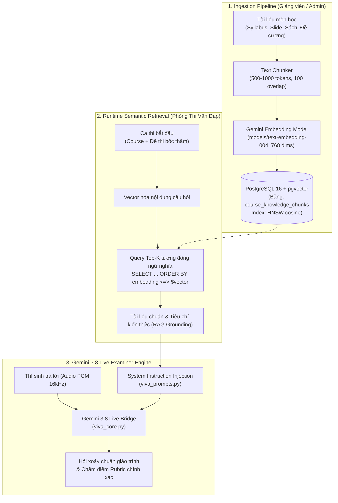

# 🧠 HƯỚNG DẪN TÍCH HỢP RAG & PGVECTOR CHO HỆ THỐNG GIÁM KHẢO AI (CORE AI)

> **Tài liệu Kỹ thuật Kiến trúc & Triển khai**  
> **Dự án:** AIVES - Hệ thống Đánh giá & Thi Vấn Đáp Trực Tuyến Tự Động  
> **Thành phần:** Core AI Oral Examiner (Gemini Live 3.8 + PGvector RAG)  
> **Ngày cập nhật:** 2026-10-03  

---

## 1. Tổng Quan Kiến Trúc RAG + PGvector

Hệ thống thi vấn đáp tự động AIVES yêu cầu Giám khảo AI không chỉ phản xạ nhanh qua giọng nói (Realtime Speech-to-Speech với Gemini 3.8 Live) mà còn phải **bám sát giáo trình chuẩn của trường**, đặt câu hỏi phụ (follow-up) chuẩn xác theo đề cương môn học và **triệt tiêu hiện tượng ảo giác (hallucination)**.

Để đạt được mục tiêu này, hệ thống áp dụng kiến trúc **RAG (Retrieval-Augmented Generation)** dựa trên **PostgreSQL pgvector**:



---

## 2. Thiết Lập Cơ Sở Dữ Liệu PostgreSQL & Extension `pgvector`

### 2.1. Kích hoạt Extension `pgvector`

PostgreSQL 16+ đã hỗ trợ extension `vector`. Chạy câu lệnh SQL sau trong database của hệ thống (ví dụ `aives_db`):

```sql
-- Kích hoạt extension vector nếu chưa có
CREATE EXTENSION IF NOT EXISTS vector;
CREATE EXTENSION IF NOT EXISTS "uuid-ossp";
```

### 2.2. DDL Bảng `course_knowledge_chunks`

Bảng lưu trữ các đoạn kiến thức (chunks) được cắt từ tài liệu môn học kèm theo vector nhúng 768 chiều (phù hợp với `models/text-embedding-004` của Google Gemini):

```sql
-- Tạo bảng lưu trữ vector tri thức môn học
CREATE TABLE IF NOT EXISTS "course_knowledge_chunks" (
    "id" UUID PRIMARY KEY DEFAULT gen_random_uuid(),
    "course_id" UUID REFERENCES "courses"("id") ON DELETE CASCADE,
    "course_code" VARCHAR(50) NOT NULL,
    "topic" VARCHAR(255) NOT NULL,
    "chapter" VARCHAR(100),
    "content" TEXT NOT NULL,
    "token_count" INTEGER DEFAULT 0,
    "embedding" vector(768) NOT NULL,
    "metadata" JSONB DEFAULT '{}'::jsonb,
    "created_at" TIMESTAMP WITH TIME ZONE DEFAULT CURRENT_TIMESTAMP,
    "updated_at" TIMESTAMP WITH TIME ZONE DEFAULT CURRENT_TIMESTAMP
);

-- Tạo Index tìm kiếm xấp xỉ siêu tốc HNSW (Hierarchical Navigable Small World)
-- Khoảng cách Cosine (<=>) được sử dụng để so khớp ngữ nghĩa tốt nhất
CREATE INDEX IF NOT EXISTS "idx_knowledge_chunks_hnsw" 
ON "course_knowledge_chunks" 
USING hnsw (embedding vector_cosine_ops)
WITH (m = 16, ef_construction = 64);

-- Index lọc theo mã môn học để tăng tốc query đa môn
CREATE INDEX IF NOT EXISTS "idx_knowledge_chunks_course_code" 
ON "course_knowledge_chunks" ("course_code");
```

---

## 3. Embedding Pipeline với Gemini (`models/text-embedding-004`)

Google Gemini cung cấp model `models/text-embedding-004` chuyên dụng cho RAG với độ trễ thấp và độ chính xác phân loại ngữ nghĩa cao.

### Đặc điểm kỹ thuật:
- **Model:** `models/text-embedding-004`
- **Output Dimension:** 768 chiều
- **Độ đo tương đồng:** Cosine Similarity (`1 - cosine_distance`)

### Mẫu Python Code tạo Embedding:

```python
from google import genai
from google.genai import types

client = genai.Client(api_key="YOUR_GEMINI_API_KEY")

def embed_text(text: str) -> list[float]:
    """Sinh vector nhúng 768 chiều từ text tài liệu."""
    response = client.models.embed_content(
        model="models/text-embedding-004",
        contents=text,
        config=types.EmbedContentConfig(
            task_type="RETRIEVAL_DOCUMENT", # hoặc "RETRIEVAL_QUERY" khi tìm kiếm
        )
    )
    return response.embedding.values
```

---

## 4. Truy Vấn Tìm Kiếm Ngữ Nghĩa (Semantic Retrieval)

Toán tử `<=>` trong `pgvector` tính toán khoảng cách Cosine Distance ($1 - \text{cosine\_similarity}$). Khoảng cách càng nhỏ, mức độ tương đồng càng cao:

```sql
-- Truy vấn Top-3 đoạn kiến thức liên quan nhất tới câu hỏi của ca thi
SELECT 
    id,
    topic,
    content,
    1 - (embedding <=> $1::vector) AS similarity_score
FROM course_knowledge_chunks
WHERE course_code = $2
  AND (1 - (embedding <=> $1::vector)) >= 0.65 -- Ngưỡng lọc rác
ORDER BY embedding <=> $1::vector ASC
LIMIT 3;
```

---

## 5. Tích Hợp RAG Vào Core AI (`python/`)

### 5.1. Cấu Hình Trong `.env` và `config.py`

Thêm các biến môi trường sau vào `python/.env`:

```env
# Cấu hình Kết nối CSDL PostgreSQL & pgvector
POSTGRES_HOST=localhost
POSTGRES_PORT=5432
POSTGRES_DB=aives_db
POSTGRES_USER=postgres
POSTGRES_PASSWORD=postgres

# Cấu hình RAG
RAG_ENABLED=true
MODEL_EMBEDDING=models/text-embedding-004
RAG_TOP_K=3
RAG_SIMILARITY_THRESHOLD=0.60
```

### 5.2. Luồng Hoạt Động của `rag_service.py`

1. Khi một ca thi bắt đầu trên WebSocket `/ws/viva/{schedule_id}`, `VivaLiveSession` trích xuất thông tin môn học và danh sách câu hỏi đề thi.
2. `rag_service` gọi Gemini tạo query embedding và truy vấn bảng `course_knowledge_chunks` trong PostgreSQL.
3. Các đoạn tri thức trích xuất được định dạng thành Markdown Grounding Block.
4. Đưa đoạn tri thức này vào `build_examiner_instructions(...)` trong `viva_prompts.py` trước khi kết nối Gemini 3.8 Live.
5. Khi kết thúc ca thi, tài liệu chuẩn này cũng được cung cấp cho `grader_service.py` để chấm điểm đúng thang Rubric.

### 5.3. Định Dạng Prompt Grounding Cho Giám Khảo AI

```markdown
--- TÀI LIỆU VÀ ĐỀ CƯƠNG CHUẨN CỦA MÔN HỌC (RAG KNOWLEDGE GROUNDING) ---
[Nguồn: Giáo trình chính thức bộ môn SWD392]
Chủ đề: Dependency Injection & Inversion of Control
Nội dung cốt lõi:
- Dependency Injection (DI) là kỹ thuật thực thi nguyên lý Inversion of Control (IoC).
- Spring Framework hỗ trợ 3 dạng DI: Constructor Injection, Setter Injection, Field Injection.
- Spring khuyến nghị Constructor Injection vì đảm bảo tính bất biến (immutability), tránh NullPointerException và thuận tiện cho Unit Testing.

HƯỚNG DẪN GIÁM KHẢO SỬ DỤNG TRI THỨC TRÊN:
1. Đối chiếu câu trả lời của thí sinh với kiến thức chuẩn trên để đánh giá mức độ chính xác.
2. Khi đặt câu hỏi phụ (follow-up), ưu tiên xoáy sâu vào các định nghĩa, đặc tính và ưu nhược điểm kỹ thuật được nêu trong tài liệu chuẩn trên.
3. Tuyệt đối không suy diễn sai lệch so với giáo trình chuẩn của môn học.
```

---

## 6. Hướng Dẫn Tùy Biến Cho Giảng Viên & Quản Trị Viên

### 6.1. Nhập Dữ Liệu Tài Liệu Tự Động (Script Ingestion)

Một script tiện ích `python/scripts/ingest_syllabus.py` cho phép Giảng viên nạp file tài liệu `.txt`, `.md` hoặc `.pdf` trực tiếp vào PGvector:

```powershell
python scripts/ingest_syllabus.py --course-code SWD392 --file ./docs/syllabus_swd392.txt
```

### 6.2. Chiến Lược Cắt Đoạn (Chunking Strategy)
- **Kích thước chunk tối ưu:** 400 - 800 từ (khoảng 500 - 1000 tokens).
- **Độ gối đầu (Overlap):** 100 tokens để giữ nguyên ngữ cảnh chuyển tiếp giữa các đoạn.
- **Tiêu đề phân đoạn (Topic metadata):** Luôn gắn thẻ `topic` hoặc `chapter` (ví dụ: `Microservices Architecture`, `Design Patterns`) để hỗ trợ lọc kết hợp (hybrid filter).

### 6.3. Tinh Chỉnh Tham Số (Tuning)
| Tham số | Giá trị khuyên dùng | Ý nghĩa |
| :--- | :--- | :--- |
| `RAG_TOP_K` | `3` (tối đa `5`) | Số đoạn kiến thức ngắn gọn đưa vào System Instruction để tránh vượt quá context window và giảm độ trễ giọng nói. |
| `RAG_SIMILARITY_THRESHOLD` | `0.65` | Điểm tương đồng tối thiểu để chấp nhận chunk, tránh nạp nội dung không liên quan. |
| `LIVE_VOICE` | `Puck` / `Aoede` | Giọng nói đọc câu hỏi và tương tác với thí sinh. |

---

## 7. Cơ Chế Dự Phòng Thông Minh (Graceful Fallback)

Nếu môi trường dev cục bộ chưa cài đặt PostgreSQL pgvector hoặc CSDL tạm thời offline:
- `rag_service.py` tự động phát hiện và chuyển sang chế độ **Syllabus Knowledge Base Fallback** (Bộ tri thức mẫu chuẩn hóa được lưu trữ cục bộ cho các môn học chính).
- Server vẫn hoạt động bình thường 100%, không bị crash hay gián đoạn phiên thi của thí sinh.
